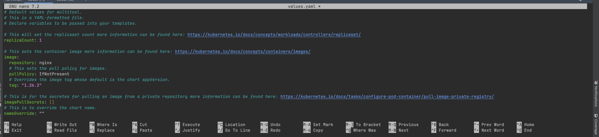
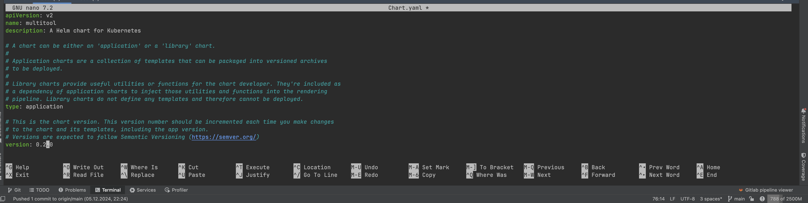
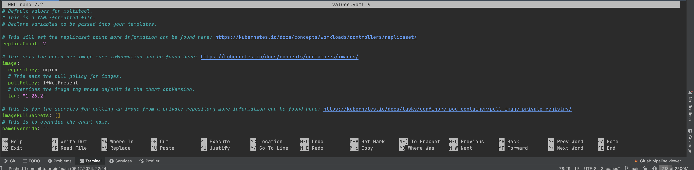
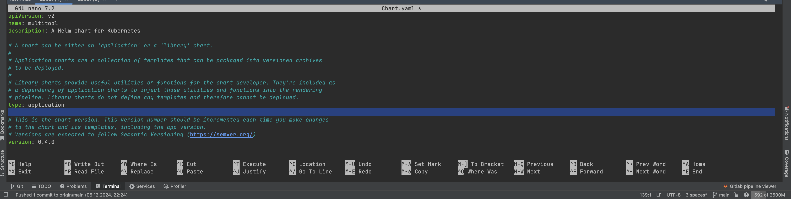
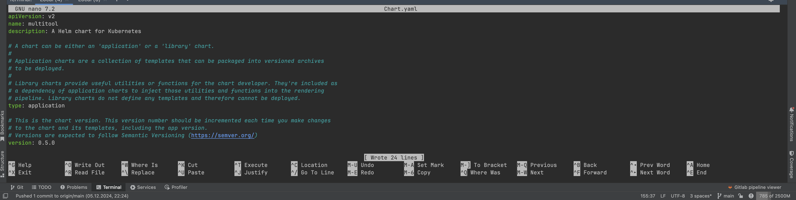

# Домашнее задание к занятию «Helm»

### Цель задания

В тестовой среде Kubernetes необходимо установить и обновить приложения с помощью Helm.

------

### Чеклист готовности к домашнему заданию

1. Установленное k8s-решение, например, MicroK8S.
2. Установленный локальный kubectl.
3. Установленный локальный Helm.
4. Редактор YAML-файлов с подключенным репозиторием GitHub.

------

### Инструменты и дополнительные материалы, которые пригодятся для выполнения задания

1. [Инструкция](https://helm.sh/docs/intro/install/) по установке Helm. [Helm completion](https://helm.sh/docs/helm/helm_completion/).

------

### Задание 1. Подготовить Helm-чарт для приложения

1. Необходимо упаковать приложение в чарт для деплоя в разные окружения.
     На своей локальной машине создаю chart:
    ```text
        dasha21a@compute-vm-2-2-20-hdd-1733425103726:~$ helm create multitool
        Creating multitool
    ```
2. Каждый компонент приложения деплоится отдельным deployment’ом или statefulset’ом.
    ```text
    dasha21a@compute-vm-2-2-20-hdd-1733425103726:~$ tree multitool/
    multitool/
    ├── Chart.yaml
    ├── charts
    ├── templates
    │ ├── NOTES.txt
    │ ├── _helpers.tpl
    │ ├── deployment.yaml
    │ ├── hpa.yaml
    │ ├── ingress.yaml
    │ ├── service.yaml
    │ ├── serviceaccount.yaml
    │ └── tests
    │     └── test-connection.yaml
    └── values.yaml
    ```
   
    Папка: [multitool](multitool)

    Установка:
    ```text 
          dasha21a@compute-vm-2-2-20-hdd-1733425103726:~$ microk8s kubectl get po
          NAME             READY   STATUS    RESTARTS      AGE
          pod-echoserver   1/1     Running   1 (24m ago)   44h
          dasha21a@compute-vm-2-2-20-hdd-1733425103726:~$ helm install multitool multitool
          NAME: multitool
          LAST DEPLOYED: Sat Dec  7 16:15:23 2024
          NAMESPACE: default
          STATUS: deployed
          REVISION: 1
          dasha21a@compute-vm-2-2-20-hdd-1733425103726:~$ microk8s kubectl get po
          NAME                         READY   STATUS    RESTARTS      AGE
          multitool-5ff87c7547-bx5vp   1/1     Running   0             4s
          pod-echoserver               1/1     Running   1 (25m ago)   44h
          dasha21a@compute-vm-2-2-20-hdd-1733425103726:~$ helm list
          NAME            NAMESPACE       REVISION        UPDATED                                 STATUS          CHART           APP VERSION
          multitool       default         1               2024-12-07 16:15:23.817040135 +0000 UTC deployed        multitool-0.1.0 1.16.0
    ```
3. В переменных чарта измените образ приложения для изменения версии.

   Изменила tag в values.yaml на 1.26.3 
   
   
   Изменила version в chart.yaml на 0.2.0
   
   
   ```text
   dasha21a@compute-vm-2-2-20-hdd-1733425103726:~$ helm upgrade multitool multitool
   Release "multitool" has been upgraded. Happy Helming!
   NAME: multitool
   LAST DEPLOYED: Sat Dec  7 16:24:47 2024
   NAMESPACE: default
   STATUS: deployed
   REVISION: 2
   dasha21a@compute-vm-2-2-20-hdd-1733425103726:~$ microk8s kubectl get po
   NAME                         READY   STATUS        RESTARTS      AGE
   multitool-5dd6db8b7c-th66g   1/1     Running       0             19s
   multitool-5ff87c7547-bx5vp   1/1     Terminating   0             9m43s
   pod-echoserver               1/1     Running       1 (34m ago)   45h
   dasha21a@compute-vm-2-2-20-hdd-1733425103726:~$ microk8s kubectl get po
   NAME                         READY   STATUS    RESTARTS      AGE
   multitool-5dd6db8b7c-th66g   1/1     Running   0             23s
   pod-echoserver               1/1     Running   1 (34m ago)   45h
   ```
------
### Задание 2. Запустить две версии в разных неймспейсах

1. Подготовив чарт, необходимо его проверить. Запуститe несколько копий приложения.

   Изменила replicaCount в values.yaml на 2
   

   ```text
      dasha21a@compute-vm-2-2-20-hdd-1733425103726:~$ helm lint multitool
      ==> Linting multitool
      [INFO] Chart.yaml: icon is recommended
      
      1 chart(s) linted, 0 chart(s) failed
      dasha21a@compute-vm-2-2-20-hdd-1733425103726:~$ helm upgrade multitool multitool
      Release "multitool" has been upgraded. Happy Helming!
      NAME: multitool
      LAST DEPLOYED: Sat Dec  7 16:26:56 2024
      NAMESPACE: default
      STATUS: deployed
      REVISION: 3
      dasha21a@compute-vm-2-2-20-hdd-1733425103726:~$ microk8s kubectl get po
      NAME                         READY   STATUS    RESTARTS      AGE
      multitool-5dd6db8b7c-8t5bd   1/1     Running   0             48s
      multitool-5dd6db8b7c-th66g   1/1     Running   0             2m57s
      pod-echoserver               1/1     Running   1 (37m ago)   45h
   ```
2. Одну версию в namespace=app1, вторую версию в том же неймспейсе, третью версию в namespace=app2.

Задеплоили версию v1 - 0.2.0 - в namespace=app1:
```text
dasha21a@compute-vm-2-2-20-hdd-1733425103726:~$ helm install --create-namespace -n app1 multitool-v1 multitool
NAME: multitool-v1
LAST DEPLOYED: Sat Dec  7 16:30:43 2024
NAMESPACE: app1
STATUS: deployed
REVISION: 1
```
Поменяли версию в values.yaml на 0.4.0


Задеплоили в тот же namespace=app1:
```text
dasha21a@compute-vm-2-2-20-hdd-1733425103726:~$ helm install --create-namespace -n app1 multitool-v2 multitool
NAME: multitool-v2
LAST DEPLOYED: Sat Dec  7 16:33:10 2024
NAMESPACE: app1
STATUS: deployed
REVISION: 1
dasha21a@compute-vm-2-2-20-hdd-1733425103726:~$ microk8s kubectl -n app1 get po
NAME                            READY   STATUS    RESTARTS   AGE
multitool-v1-997c7c99c-ltr6j    1/1     Running   0          3m8s
multitool-v1-997c7c99c-pgjmt    1/1     Running   0          3m8s
multitool-v2-76b974bb74-kg4cp   1/1     Running   0          40s
multitool-v2-76b974bb74-nqm75   1/1     Running   0          40s
```

Поменяли версию в values.yaml на 0.5.0


Задеплоили в namespace=app2:
```text
dasha21a@compute-vm-2-2-20-hdd-1733425103726:~$ helm install --create-namespace -n app2 multitool-v3 multitool
NAME: multitool-v3
LAST DEPLOYED: Sat Dec  7 16:35:43 2024
NAMESPACE: app2
STATUS: deployed
REVISION: 1
dasha21a@compute-vm-2-2-20-hdd-1733425103726:~$ microk8s kubectl -n app2 get po
NAME                            READY   STATUS    RESTARTS   AGE
multitool-v3-75755485b6-6bm7s   1/1     Running   0          14s
multitool-v3-75755485b6-gbm55   1/1     Running   0          14s

```
3. Продемонстрируйте результат.

### Правила приёма работы

1. Домашняя работа оформляется в своём Git репозитории в файле README.md. Выполненное домашнее задание пришлите ссылкой на .md-файл в вашем репозитории.
2. Файл README.md должен содержать скриншоты вывода необходимых команд `kubectl`, `helm`, а также скриншоты результатов.
3. Репозиторий должен содержать тексты манифестов или ссылки на них в файле README.md.