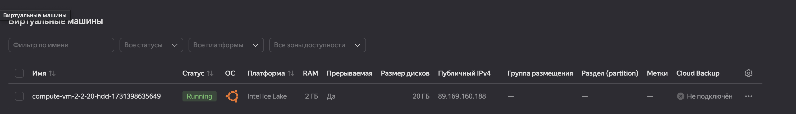
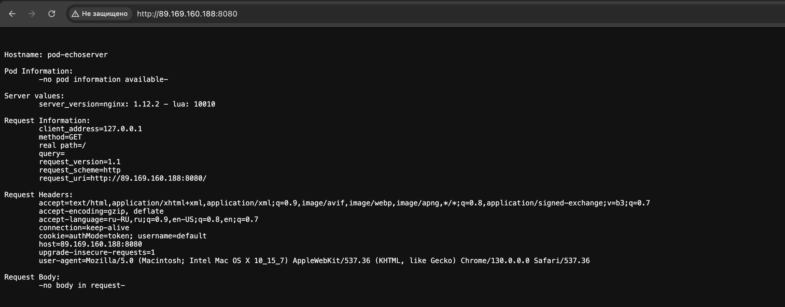
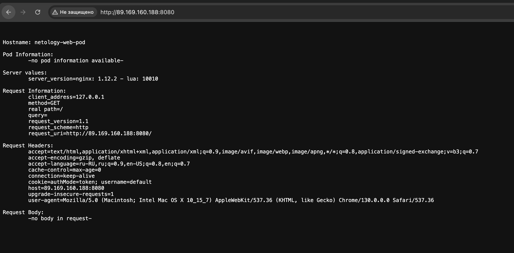

# Домашнее задание к занятию «Базовые объекты K8S»

### Цель задания

В тестовой среде для работы с Kubernetes, установленной в предыдущем ДЗ, необходимо развернуть Pod с приложением и подключиться к нему со своего локального компьютера.

------

### Чеклист готовности к домашнему заданию

1. Установленное k8s-решение (например, MicroK8S).
2. Установленный локальный kubectl.
3. Редактор YAML-файлов с подключенным Git-репозиторием.

------

### Инструменты и дополнительные материалы, которые пригодятся для выполнения задания

1. Описание [Pod](https://kubernetes.io/docs/concepts/workloads/pods/) и примеры манифестов.
2. Описание [Service](https://kubernetes.io/docs/concepts/services-networking/service/).

------

Домашнее задание выполнялось на ВМ в Yandex Cloud:


### Задание 1. Создать Pod с именем hello-world

1. Создать манифест (yaml-конфигурацию) Pod.
2. Использовать image - gcr.io/kubernetes-e2e-test-images/echoserver:2.2.
3. Подключиться локально к Pod с помощью `kubectl port-forward` и вывести значение (curl или в браузере).

## Решение
Файл Pod - [pod.yaml](file/pod.yaml)

Создание Pod:
```text
dasha21a@compute-vm-2-2-20-hdd-1731398635649:~$ microk8s kubectl apply -f pod.yaml 
pod/pod-echoserver created
```

Вывод трафика:
```text
dasha21a@compute-vm-2-2-20-hdd-1731398635649:~$ microk8s kubectl port-forward -n default pod/pod-echoserver 8080:8080 --address='0.0.0.0'
Forwarding from 0.0.0.0:8080 -> 8080
Handling connection for 8080
Handling connection for 8080
Handling connection for 8080
Handling connection for 8080
```

Скришот вывода:


```text


Hostname: pod-echoserver

Pod Information:
	-no pod information available-

Server values:
	server_version=nginx: 1.12.2 - lua: 10010

Request Information:
	client_address=127.0.0.1
	method=GET
	real path=/
	query=
	request_version=1.1
	request_scheme=http
	request_uri=http://89.169.160.188:8080/

Request Headers:
	accept=text/html,application/xhtml+xml,application/xml;q=0.9,image/avif,image/webp,image/apng,*/*;q=0.8,application/signed-exchange;v=b3;q=0.7  
	accept-encoding=gzip, deflate  
	accept-language=ru-RU,ru;q=0.9,en-US;q=0.8,en;q=0.7  
	connection=keep-alive  
	cookie=authMode=token; username=default  
	host=89.169.160.188:8080  
	upgrade-insecure-requests=1  
	user-agent=Mozilla/5.0 (Macintosh; Intel Mac OS X 10_15_7) AppleWebKit/537.36 (KHTML, like Gecko) Chrome/130.0.0.0 Safari/537.36  

Request Body:
	-no body in request-
```

Скришот вывода:


```text
Hostname: netology-web-pod

Pod Information:
	-no pod information available-

Server values:
	server_version=nginx: 1.12.2 - lua: 10010

Request Information:
	client_address=127.0.0.1
	method=GET
	real path=/
	query=
	request_version=1.1
	request_scheme=http
	request_uri=http://89.169.160.188:8080/

Request Headers:
	accept=text/html,application/xhtml+xml,application/xml;q=0.9,image/avif,image/webp,image/apng,*/*;q=0.8,application/signed-exchange;v=b3;q=0.7  
	accept-encoding=gzip, deflate  
	accept-language=ru-RU,ru;q=0.9,en-US;q=0.8,en;q=0.7  
	cache-control=max-age=0  
	connection=keep-alive  
	cookie=authMode=token; username=default  
	host=89.169.160.188:8080  
	upgrade-insecure-requests=1  
	user-agent=Mozilla/5.0 (Macintosh; Intel Mac OS X 10_15_7) AppleWebKit/537.36 (KHTML, like Gecko) Chrome/130.0.0.0 Safari/537.36  

Request Body:
	-no body in request-

```
------

### Задание 2. Создать Service и подключить его к Pod

1. Создать Pod с именем netology-web.
2. Использовать image — gcr.io/kubernetes-e2e-test-images/echoserver:2.2.
3. Создать Service с именем netology-svc и подключить к netology-web.
4. Подключиться локально к Service с помощью `kubectl port-forward` и вывести значение (curl или в браузере).

## Решение
Файл Pod - [netology-web-pod.yaml](file/netology-web-pod.yaml)
Файл Service - [netology-web-service.yaml](file/netology-web-service.yaml)

Созданные Pod:
```text
dasha21a@compute-vm-2-2-20-hdd-1731398635649:~$ microk8s kubectl get po
NAME               READY   STATUS    RESTARTS   AGE
netology-web-pod   1/1     Running   0          111s
pod-echoserver     1/1     Running   0          8m33s
```

Созданные Service:
```text
dasha21a@compute-vm-2-2-20-hdd-1731398635649:~$ microk8s kubectl get service
NAME               TYPE        CLUSTER-IP       EXTERNAL-IP   PORT(S)   AGE
kubernetes         ClusterIP   10.152.183.1     <none>        443/TCP   25m
netology-web-svc   ClusterIP   10.152.183.189   <none>        80/TCP    106s

```

Вывод трафика:
```text
dasha21a@compute-vm-2-2-20-hdd-1731398635649:~$ microk8s kubectl port-forward -n default pod/netology-web-pod 8080:8080 --address='0.0.0.0'
Forwarding from 0.0.0.0:8080 -> 8080
Handling connection for 8080
Handling connection for 8080
```


------

### Правила приёма работы

1. Домашняя работа оформляется в своем Git-репозитории в файле README.md. Выполненное домашнее задание пришлите ссылкой на .md-файл в вашем репозитории.
2. Файл README.md должен содержать скриншоты вывода команд `kubectl get pods`, а также скриншот результата подключения.
3. Репозиторий должен содержать файлы манифестов и ссылки на них в файле README.md.

------

### Критерии оценки
Зачёт — выполнены все задания, ответы даны в развернутой форме, приложены соответствующие скриншоты и файлы проекта, в выполненных заданиях нет противоречий и нарушения логики.

На доработку — задание выполнено частично или не выполнено, в логике выполнения заданий есть противоречия, существенные недостатки.