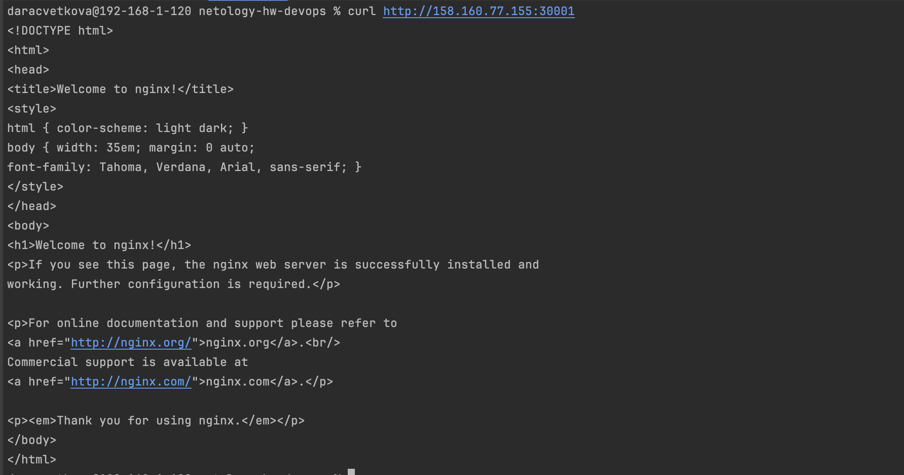

# Домашнее задание к занятию «Сетевое взаимодействие в K8S. Часть 1»

### Цель задания

В тестовой среде Kubernetes необходимо обеспечить доступ к приложению, установленному в предыдущем ДЗ и состоящему из двух контейнеров, по разным портам в разные контейнеры как внутри кластера, так и снаружи.

------

### Чеклист готовности к домашнему заданию

1. Установленное k8s-решение (например, MicroK8S).
2. Установленный локальный kubectl.
3. Редактор YAML-файлов с подключённым Git-репозиторием.

------

### Инструменты и дополнительные материалы, которые пригодятся для выполнения задания

1. [Описание](https://kubernetes.io/docs/concepts/workloads/controllers/deployment/) Deployment и примеры манифестов.
2. [Описание](https://kubernetes.io/docs/concepts/services-networking/service/) Описание Service.
3. [Описание](https://github.com/wbitt/Network-MultiTool) Multitool.

------

### Задание 1. Создать Deployment и обеспечить доступ к контейнерам приложения по разным портам из другого Pod внутри кластера

1. Создать Deployment приложения, состоящего из двух контейнеров (nginx и multitool), с количеством реплик 3 шт.
    ```text
    dasha21a@compute-vm-2-2-20-hdd-1731398635649:~$ microk8s kubectl get po
    NAME                                READY   STATUS    RESTARTS   AGE
    deployment-nginx-7cdc889dc9-4r9p4   2/2     Running   0          53m
    deployment-nginx-7cdc889dc9-5d4zf   2/2     Running   0          53m
    deployment-nginx-7cdc889dc9-5z8gq   2/2     Running   0          53m
    ```
2. Создать Service, который обеспечит доступ внутри кластера до контейнеров приложения из п.1 по порту 9001 — nginx 80, по 9002 — multitool 8080.
    ```text
    dasha21a@compute-vm-2-2-20-hdd-1731398635649:~$ microk8s kubectl get service
    NAME            TYPE        CLUSTER-IP       EXTERNAL-IP   PORT(S)             AGE
    kubernetes      ClusterIP   10.152.183.1     <none>        443/TCP             53m
    nginx-service   ClusterIP   10.152.183.175   <none>        9001/TCP,9002/TCP   52m
    ```
3. Создать отдельный Pod с приложением multitool и убедиться с помощью `curl`, что из пода есть доступ до приложения из п.1 по разным портам в разные контейнеры.
4. Продемонстрировать доступ с помощью `curl` по доменному имени сервиса.
   
   
5. Предоставить манифесты Deployment и Service в решении, а также скриншоты или вывод команды п.4.
   [deployment.yaml](file/deployment.yaml)
   [service.yaml](file/service.yaml)
------

### Задание 2. Создать Service и обеспечить доступ к приложениям снаружи кластера

1. Создать отдельный Service приложения из Задания 1 с возможностью доступа снаружи кластера к nginx, используя тип NodePort.
    ```text
    dasha21a@compute-vm-2-2-20-hdd-1731398635649:~$ microk8s kubectl get service
    NAME                     TYPE        CLUSTER-IP       EXTERNAL-IP   PORT(S)             AGE
    kubernetes               ClusterIP   10.152.183.1     <none>        443/TCP             55m
    nginx-service            ClusterIP   10.152.183.175   <none>        9001/TCP,9002/TCP   55m
    nginx-service-nodeport   NodePort    10.152.183.38    <none>        80:30001/TCP        4s
    
    ```
2. Продемонстрировать доступ с помощью браузера или `curl` с локального компьютера.
   

   ```text
   daracvetkova@192-168-1-120 netology-hw-devops % curl http://158.160.77.155:30001
   <!DOCTYPE html>
   <html>
   <head>
   <title>Welcome to nginx!</title>
   <style>
   html { color-scheme: light dark; }
   body { width: 35em; margin: 0 auto;
   font-family: Tahoma, Verdana, Arial, sans-serif; }
   </style>
   </head>
   <body>
   <h1>Welcome to nginx!</h1>
   <p>If you see this page, the nginx web server is successfully installed and
   working. Further configuration is required.</p>
   
   <p>For online documentation and support please refer to
   <a href="http://nginx.org/">nginx.org</a>.<br/>
   Commercial support is available at
   <a href="http://nginx.com/">nginx.com</a>.</p>
   
   <p><em>Thank you for using nginx.</em></p>
   </body>
   </html>
   ```
3. Предоставить манифест и Service в решении, а также скриншоты или вывод команды п.2.
   [service-nodeport.yaml](file/service-nodeport.yaml)

------

### Правила приёма работы

1. Домашняя работа оформляется в своем Git-репозитории в файле README.md. Выполненное домашнее задание пришлите ссылкой на .md-файл в вашем репозитории.
2. Файл README.md должен содержать скриншоты вывода необходимых команд `kubectl` и скриншоты результатов.
3. Репозиторий должен содержать тексты манифестов или ссылки на них в файле README.md.
