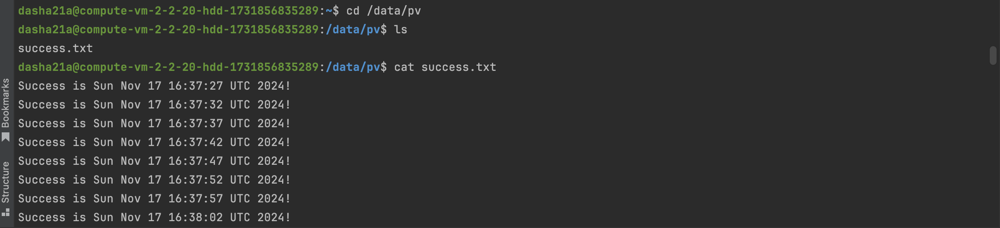
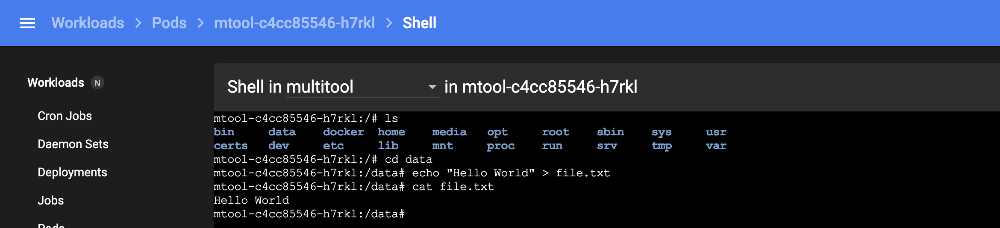

# Домашнее задание к занятию «Хранение в K8s. Часть 2»

### Цель задания

В тестовой среде Kubernetes нужно создать PV и продемострировать запись и хранение файлов.

------

### Чеклист готовности к домашнему заданию

1. Установленное K8s-решение (например, MicroK8S).
2. Установленный локальный kubectl.
3. Редактор YAML-файлов с подключенным GitHub-репозиторием.

------

### Дополнительные материалы для выполнения задания

1. [Инструкция по установке NFS в MicroK8S](https://microk8s.io/docs/nfs).
2. [Описание Persistent Volumes](https://kubernetes.io/docs/concepts/storage/persistent-volumes/).
3. [Описание динамического провижининга](https://kubernetes.io/docs/concepts/storage/dynamic-provisioning/).
4. [Описание Multitool](https://github.com/wbitt/Network-MultiTool).

------

### Задание 1

**Что нужно сделать**

Создать Deployment приложения, использующего локальный PV, созданный вручную.

1. Создать Deployment приложения, состоящего из контейнеров busybox и multitool.
    [deployment](file/deployment.yaml)
    ```text
      dasha21a@compute-vm-2-2-20-hdd-1731856835289:~$ microk8s kubectl get deploy
      NAME                READY   UP-TO-DATE   AVAILABLE   AGE
      busybox-multitool   1/1     1            1           4m7s
    ```
2. Создать PV и PVC для подключения папки на локальной ноде, которая будет использована в поде.
   [PVC](file/pvc.yaml)
    ```text
            dasha21a@compute-vm-2-2-20-hdd-1731856835289:~$ microk8s kubectl get pvc
            NAME   STATUS   VOLUME   CAPACITY   ACCESS MODES   STORAGECLASS   VOLUMEATTRIBUTESCLASS   AGE
            pvc    Bound    pv       2Gi        RWO                           <unset>                 3m18s

    ```
   [PV](file/pv.yaml)
    ```text
         dasha21a@compute-vm-2-2-20-hdd-1731856835289:~$ microk8s kubectl get pv
         NAME   CAPACITY   ACCESS MODES   RECLAIM POLICY   STATUS   CLAIM         STORAGECLASS   VOLUMEATTRIBUTESCLASS   REASON   AGE
         pv     2Gi        RWO            Delete           Bound    default/pvc                  <unset>                          3m44s

    ```
3. Продемонстрировать, что multitool может читать файл, в который busybox пишет каждые пять секунд в общей директории.
```text
/ # cd test1
/test1 # ls
success.txt
/test1 # cat success.txt 
Success is Sun Nov 17 16:37:27 UTC 2024!
Success is Sun Nov 17 16:37:32 UTC 2024!
Success is Sun Nov 17 16:37:37 UTC 2024!
Success is Sun Nov 17 16:37:42 UTC 2024!
Success is Sun Nov 17 16:37:47 UTC 2024!
Success is Sun Nov 17 16:37:52 UTC 2024!
Success is Sun Nov 17 16:37:57 UTC 2024!
Success is Sun Nov 17 16:38:02 UTC 2024!
Success is Sun Nov 17 16:38:07 UTC 2024!
Success is Sun Nov 17 16:38:12 UTC 2024!
Success is Sun Nov 17 16:38:17 UTC 2024!
Success is Sun Nov 17 16:38:22 UTC 2024!
Success is Sun Nov 17 16:38:27 UTC 2024!
Success is Sun Nov 17 16:38:32 UTC 2024!
Success is Sun Nov 17 16:38:37 UTC 2024!
Success is Sun Nov 17 16:38:42 UTC 2024!
Success is Sun Nov 17 16:38:47 UTC 2024!
Success is Sun Nov 17 16:38:52 UTC 2024!
```
4. Удалить Deployment и PVC. Продемонстрировать, что после этого произошло с PV. Пояснить, почему.
```text
При удалении Deployment и PVC потеряет статус Bound, но останется существовать в системе
После удаления PV в моем случае файл так же останется существовать, так как его наличие регламентируется политиками:
Reclaim Policy
Current reclaim policies are:
  Retain -- manual reclamation
  Recycle -- basic scrub (rm -rf /thevolume/*)
  Delete -- delete the volume
```
5. Продемонстрировать, что файл сохранился на локальном диске ноды. Удалить PV.  Продемонстрировать что произошло с файлом после удаления PV. Пояснить, почему.
   
6. Предоставить манифесты, а также скриншоты или вывод необходимых команд.

------

### Задание 2

**Что нужно сделать**

Создать Deployment приложения, которое может хранить файлы на NFS с динамическим созданием PV.

1. Включить и настроить NFS-сервер на MicroK8S. 
```text
dasha21a@compute-vm-2-2-20-hdd-1731856835289:/data/pv$ sudo microk8s enable  nfs
Infer repository community for addon nfs
Infer repository core for addon helm3
Addon core/helm3 is already enabled
Installing NFS Server Provisioner - Helm Chart 1.4.0

Node Name not defined. NFS Server Provisioner will be deployed on random Microk8s Node.

If you want to use a dedicated (large disk space) Node as NFS Server, disable the Addon and start over: microk8s enable nfs -n NODE_NAME
Lookup Microk8s Node name as: kubectl get node -o yaml | grep 'kubernetes.io/hostname'

Preparing PV for NFS Server Provisioner

persistentvolume/data-nfs-server-provisioner-0 created
"nfs-ganesha-server-and-external-provisioner" has been added to your repositories
Release "nfs-server-provisioner" does not exist. Installing it now.
NAME: nfs-server-provisioner
LAST DEPLOYED: Sun Nov 17 17:10:35 2024
NAMESPACE: nfs-server-provisioner
STATUS: deployed
REVISION: 1
TEST SUITE: None
NOTES:
The NFS Provisioner service has now been installed.

A storage class named 'nfs' has now been created
and is available to provision dynamic volumes.

You can use this storageclass by creating a `PersistentVolumeClaim` with the
correct storageClassName attribute. For example:

    ---
    kind: PersistentVolumeClaim
    apiVersion: v1
    metadata:
      name: test-dynamic-volume-claim
    spec:
      storageClassName: "nfs"
      accessModes:
        - ReadWriteOnce
      resources:
        requests:
          storage: 100Mi

NFS Server Provisioner is installed

WARNING: Install "nfs-common" package on all MicroK8S nodes to allow Pods with NFS mounts to start: sudo apt update && sudo apt install -y nfs-common
WARNING: NFS Server Provisioner servers by default hostPath storage from a single Node.
dasha21a@compute-vm-2-2-20-hdd-1731856835289:/data/pv$ sudo apt update && sudo apt install -y nfs-common
Hit:1 http://security.ubuntu.com/ubuntu noble-security InRelease
Hit:2 http://archive.ubuntu.com/ubuntu noble InRelease
Get:3 http://archive.ubuntu.com/ubuntu noble-updates InRelease [126 kB]
Hit:4 http://archive.ubuntu.com/ubuntu noble-backports InRelease
Fetched 126 kB in 1s (118 kB/s)
Reading package lists... Done
Building dependency tree... Done
Reading state information... Done
19 packages can be upgraded. Run 'apt list --upgradable' to see them.
Reading package lists... Done
Building dependency tree... Done
Reading state information... Done
nfs-common is already the newest version (1:2.6.4-3ubuntu5).
0 upgraded, 0 newly installed, 0 to remove and 19 not upgraded.

```
2. Создать Deployment приложения состоящего из multitool, и подключить к нему PV, созданный автоматически на сервере NFS.
[](file/deployment-nfs.yaml) 
```text
dasha21a@compute-vm-2-2-20-hdd-1731856835289:/data/pv$ microk8s kubectl get po -n nfs-server-provisioner
NAME                       READY   STATUS    RESTARTS   AGE
mtool-c4cc85546-h7rkl      1/1     Running   0          8m25s
nfs-server-provisioner-0   1/1     Running   0          15m
```
[](file/pvc-nfs.yaml)
```text
dasha21a@compute-vm-2-2-20-hdd-1731856835289:/data/pv$ microk8s kubectl get pvc -n nfs-server-provisioner
NAME                            STATUS   VOLUME                                     CAPACITY   ACCESS MODES   STORAGECLASS   VOLUMEATTRIBUTESCLASS   AGE
data-nfs-server-provisioner-0   Bound    data-nfs-server-provisioner-0              1Gi        RWO                           <unset>                 16m
nfs-pvc                         Bound    pvc-63c042e5-0d55-44eb-9d24-b42bafd15380   1Gi        RWX            nfs            <unset>                 6m10s
```
3. Продемонстрировать возможность чтения и записи файла изнутри пода.

4. Предоставить манифесты, а также скриншоты или вывод необходимых команд.

------

### Правила приёма работы

1. Домашняя работа оформляется в своём Git-репозитории в файле README.md. Выполненное задание пришлите ссылкой на .md-файл в вашем репозитории.
2. Файл README.md должен содержать скриншоты вывода необходимых команд `kubectl`, а также скриншоты результатов.
3. Репозиторий должен содержать тексты манифестов или ссылки на них в файле README.md.