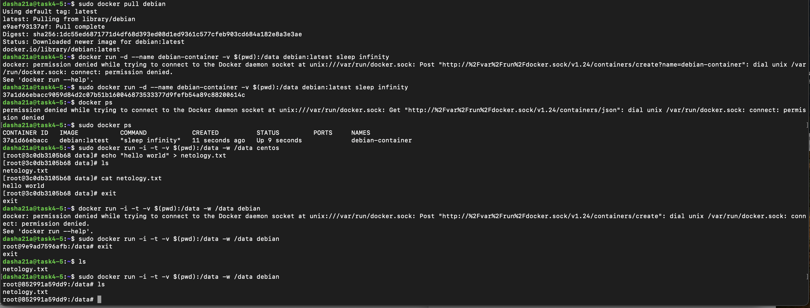

# Домашнее задание к занятию 4 «Оркестрация группой Docker контейнеров на примере Docker Compose»

### Инструкция к выполению

1. Для выполнения заданий обязательно ознакомьтесь с [инструкцией](https://github.com/netology-code/devops-materials/blob/master/cloudwork.MD) по экономии облачных ресурсов. Это нужно, чтобы не расходовать средства, полученные в результате использования промокода.
2. Практические задачи выполняйте на личной рабочей станции или созданной вами ранее ВМ в облаке.
3. Своё решение к задачам оформите в вашем GitHub репозитории в формате markdown!!!
4. В личном кабинете отправьте на проверку ссылку на .md-файл в вашем репозитории.

## Задача 1

Сценарий выполнения задачи:
- Установите docker и docker compose plugin на свою linux рабочую станцию или ВМ.
- Если dockerhub недоступен создайте файл /etc/docker/daemon.json с содержимым: ```{"registry-mirrors": ["https://mirror.gcr.io", "https://daocloud.io", "https://c.163.com/", "https://registry.docker-cn.com"]}```
- Зарегистрируйтесь и создайте публичный репозиторий  с именем "custom-nginx" на https://hub.docker.com (ТОЛЬКО ЕСЛИ У ВАС ЕСТЬ ДОСТУП);
- скачайте образ nginx:1.21.1;
- Создайте Dockerfile и реализуйте в нем замену дефолтной индекс-страницы(/usr/share/nginx/html/index.html), на файл index.html с содержимым:
```
<html>
<head>
Hey, Netology
</head>
<body>
<h1>I will be DevOps Engineer!</h1>
</body>
</html>
```
- Соберите и отправьте созданный образ в свой dockerhub-репозитории c tag 1.0.0 (ТОЛЬКО ЕСЛИ ЕСТЬ ДОСТУП). 
- Предоставьте ответ в виде ссылки на https://hub.docker.com/<username_repo>/custom-nginx/general .

## Ответ на задачу 1
Docker скачен на машину
```bash
daracvetkova@192-168-1-120 ~ % docker --version
Docker version 25.0.3, build 4debf41
```

Выкачиваем образ nginx
```bash
daracvetkova@192-168-1-120 ~ % docker pull nginx:1.21.1
1.21.1: Pulling from library/nginx
d10c227306ce: Pull complete 
3b3450d77825: Pull complete 
976f19f897eb: Pull complete 
cf2a5bf96bb5: Pull complete 
218cda107c30: Pull complete 
49f49174f1f4: Pull complete 
Digest: sha256:a05b0cdd4fc1be3b224ba9662ebdf98fe44c09c0c9215b45f84344c12867002e
Status: Downloaded newer image for nginx:1.21.1
docker.io/library/nginx:1.21.1
```

Собираем custom-образ с помощью Dockerfile
```bash
daracvetkova@192-168-1-120 Виртуализация и контейнеризация % docker build -t 217982792/custom-nginx:1.0.0 .
[+] Building 0.1s (7/7) FINISHED                                                                                                                                                                                      docker:desktop-linux
 => [internal] load build definition from Dockerfile                                                                                                                                                                                  0.0s
 => => transferring dockerfile: 110B                                                                                                                                                                                                  0.0s
 => [internal] load metadata for docker.io/library/nginx:1.21.1                                                                                                                                                                       0.0s
 => [internal] load .dockerignore                                                                                                                                                                                                     0.0s
 => => transferring context: 2B                                                                                                                                                                                                       0.0s
 => [internal] load build context                                                                                                                                                                                                     0.0s
 => => transferring context: 64B                                                                                                                                                                                                      0.0s
 => [1/2] FROM docker.io/library/nginx:1.21.1                                                                                                                                                                                         0.0s
 => CACHED [2/2] COPY static/index.html /usr/share/nginx/html/index.html                                                                                                                                                              0.0s
 => exporting to image                                                                                                                                                                                                                0.0s
 => => exporting layers                                                                                                                                                                                                               0.0s
 => => writing image sha256:f807ddc1c3ed9061d87b053c5a1594201b8140602d2e901f4e1d1e0c9d71c2d0                                                                                                                                          0.0s
 => => naming to docker.io/217982792/custom-nginx:1.0.0                                                                                                                                                                               0.0s

What's Next?
  View a summary of image vulnerabilities and recommendations → docker scout quickview

daracvetkova@192-168-1-120 Виртуализация и контейнеризация % docker images
REPOSITORY                                       TAG                IMAGE ID       CREATED         SIZE
217982792/custom-nginx                           1.0.0              f807ddc1c3ed   2 hours ago     126MB
```

Push образ в docker.hub 
```bash
daracvetkova@192-168-1-120 Виртуализация и контейнеризация % docker push 217982792/custom-nginx:1.0.0
The push refers to repository [docker.io/217982792/custom-nginx]
63e21b935f74: Pushed 
f7426c886fe8: Mounted from library/nginx 
37d2816e0616: Mounted from library/nginx 
514a41abcc92: Mounted from library/nginx 
85b224b9deda: Mounted from library/nginx 
d98ea0fbe5ea: Mounted from library/nginx 
5f140fe6ea25: Mounted from library/nginx 
1.0.0: digest: sha256:40f0b8b23ea7f74c0e222213f483d091744ea9e50131b540b6dd9dfa4457a7ee size: 1777
```

Ссылка: https://hub.docker.com/repository/docker/217982792/custom-nginx/general


## Задача 2
1. Запустите ваш образ custom-nginx:1.0.0 командой docker run в соответвии с требованиями:
- имя контейнера "ФИО-custom-nginx-t2"
- контейнер работает в фоне
- контейнер опубликован на порту хост системы 127.0.0.1:8080
2. Не удаляя, переименуйте контейнер в "custom-nginx-t2"
3. Выполните команду ```date +"%d-%m-%Y %T.%N %Z" ; sleep 0.150 ; docker ps ; ss -tlpn | grep 127.0.0.1:8080  ; docker logs custom-nginx-t2 -n1 ; docker exec -it custom-nginx-t2 base64 /usr/share/nginx/html/index.html```
4. Убедитесь с помощью curl или веб браузера, что индекс-страница доступна.

В качестве ответа приложите скриншоты консоли, где видно все введенные команды и их вывод.

Запустился контейнер
```bash
docker run --name tsvetkova_daria_alex_custom_nginx_t2 -d -p 8080:80 217982792/custom-nginx:1.0.0

daracvetkova@192-168-1-120 Виртуализация и контейнеризация % docker ps
CONTAINER ID   IMAGE                          COMMAND                  CREATED          STATUS          PORTS                            NAMES
2fa99d4670f2   217982792/custom-nginx:1.0.0   "/docker-entrypoint.…"   26 seconds ago   Up 25 seconds   80/tcp, 0.0.0.0:8080->8080/tcp   tsvetkova_daria_alex_custom_nginx_t2
```

Переименовали контейнер без перезапуска
```bash
daracvetkova@192-168-1-120 Виртуализация и контейнеризация % docker rename tsvetkova_daria_alex_custom_nginx_t2 custom-nginx-t2 
daracvetkova@192-168-1-120 Виртуализация и контейнеризация % docker ps
CONTAINER ID   IMAGE                          COMMAND                  CREATED              STATUS              PORTS                            NAMES
2fa99d4670f2   217982792/custom-nginx:1.0.0   "/docker-entrypoint.…"   About a minute ago   Up About a minute   80/tcp, 0.0.0.0:8080->8080/tcp   custom-nginx-t2
```

Вот так выглядит страница:


```bash
daracvetkova@192-168-1-120 Виртуализация и контейнеризация % curl -kv http://localhost:8080
*   Trying [::1]:8080...
* Connected to localhost (::1) port 8080
> GET / HTTP/1.1
> Host: localhost:8080
> User-Agent: curl/8.4.0
> Accept: */*
> 
< HTTP/1.1 200 OK
< Server: nginx/1.21.1
< Date: Sun, 21 Jul 2024 17:04:30 GMT
< Content-Type: text/html
< Content-Length: 98
< Last-Modified: Sun, 21 Jul 2024 14:33:23 GMT
< Connection: keep-alive
< ETag: "669d1c33-62"
< Accept-Ranges: bytes
< 
<html>
<head>
    Hey, Netology
</head>
<body>
<h1>I will be DevOps Engineer!</h1>
</body>
* Connection #0 to host localhost left intact
</html>%       
```
## Задача 3
1. Воспользуйтесь docker help или google, чтобы узнать как подключиться к стандартному потоку ввода/вывода/ошибок контейнера "custom-nginx-t2".
```bash
  docker attach custom-nginx-t2 
```
2. Подключитесь к контейнеру и нажмите комбинацию Ctrl-C.
3. Выполните ```docker ps -a``` и объясните своими словами почему контейнер остановился.
```bash
daracvetkova@192-168-1-120 Виртуализация и контейнеризация % docker ps -a
CONTAINER ID   IMAGE                          COMMAND                  CREATED         STATUS                      PORTS     NAMES
d2020d4cd375   217982792/custom-nginx:1.0.0   "/docker-entrypoint.…"   6 minutes ago   Exited (0) 16 seconds ago             custom-nginx-t2
 
 Контейнер закрылся из-за отсутствия активных процессов
```
4. Перезапустите контейнер
```bash
daracvetkova@192-168-1-120 Виртуализация и контейнеризация % docker restart custom-nginx-t2
custom-nginx-t2
```
5. Зайдите в интерактивный терминал контейнера "custom-nginx-t2" с оболочкой bash.
```bash
daracvetkova@192-168-1-120 Виртуализация и контейнеризация % docker exec -it custom-nginx-t2 bash
root@d2020d4cd375:/# 
```
6. Установите любимый текстовый редактор(vim, nano итд) с помощью apt-get.
```bash
root@d2020d4cd375:/#  apt-get install vim
Reading package lists... Done
Building dependency tree       
Reading state information... Done
The following additional packages will be installed:
  libgpm2 vim-common vim-runtime xxd
Suggested packages:
  gpm ctags vim-doc vim-scripts
The following NEW packages will be installed:
  libgpm2 vim vim-common vim-runtime xxd
0 upgraded, 5 newly installed, 0 to remove and 56 not upgraded.
Need to get 7340 kB of archives.
After this operation, 33.9 MB of additional disk space will be used.
Do you want to continue? [Y/n] y
Get:1 http://deb.debian.org/debian buster/main arm64 libgpm2 arm64 1.20.7-5 [34.5 kB]
Get:2 http://security.debian.org/debian-security buster/updates/main arm64 xxd arm64 2:8.1.0875-5+deb10u6 [140 kB]
Get:3 http://security.debian.org/debian-security buster/updates/main arm64 vim-common all 2:8.1.0875-5+deb10u6 [196 kB]
Get:4 http://security.debian.org/debian-security buster/updates/main arm64 vim-runtime all 2:8.1.0875-5+deb10u6 [5777 kB]
Get:5 http://security.debian.org/debian-security buster/updates/main arm64 vim arm64 2:8.1.0875-5+deb10u6 [1192 kB]
Fetched 7340 kB in 1s (11.9 MB/s)
debconf: delaying package configuration, since apt-utils is not installed
Selecting previously unselected package xxd.
(Reading database ... 7631 files and directories currently installed.)
Preparing to unpack .../xxd_2%3a8.1.0875-5+deb10u6_arm64.deb ...
Unpacking xxd (2:8.1.0875-5+deb10u6) ...
Selecting previously unselected package vim-common.
Preparing to unpack .../vim-common_2%3a8.1.0875-5+deb10u6_all.deb ...
Unpacking vim-common (2:8.1.0875-5+deb10u6) ...
Selecting previously unselected package libgpm2:arm64.
Preparing to unpack .../libgpm2_1.20.7-5_arm64.deb ...
Unpacking libgpm2:arm64 (1.20.7-5) ...
Selecting previously unselected package vim-runtime.
Preparing to unpack .../vim-runtime_2%3a8.1.0875-5+deb10u6_all.deb ...
Adding 'diversion of /usr/share/vim/vim81/doc/help.txt to /usr/share/vim/vim81/doc/help.txt.vim-tiny by vim-runtime'
Adding 'diversion of /usr/share/vim/vim81/doc/tags to /usr/share/vim/vim81/doc/tags.vim-tiny by vim-runtime'
Unpacking vim-runtime (2:8.1.0875-5+deb10u6) ...
Selecting previously unselected package vim.
Preparing to unpack .../vim_2%3a8.1.0875-5+deb10u6_arm64.deb ...
Unpacking vim (2:8.1.0875-5+deb10u6) ...
Setting up libgpm2:arm64 (1.20.7-5) ...
Setting up xxd (2:8.1.0875-5+deb10u6) ...
Setting up vim-common (2:8.1.0875-5+deb10u6) ...
Setting up vim-runtime (2:8.1.0875-5+deb10u6) ...
Setting up vim (2:8.1.0875-5+deb10u6) ...
update-alternatives: using /usr/bin/vim.basic to provide /usr/bin/vim (vim) in auto mode
update-alternatives: using /usr/bin/vim.basic to provide /usr/bin/vimdiff (vimdiff) in auto mode
update-alternatives: using /usr/bin/vim.basic to provide /usr/bin/rvim (rvim) in auto mode
update-alternatives: using /usr/bin/vim.basic to provide /usr/bin/rview (rview) in auto mode
update-alternatives: using /usr/bin/vim.basic to provide /usr/bin/vi (vi) in auto mode
update-alternatives: warning: skip creation of /usr/share/man/da/man1/vi.1.gz because associated file /usr/share/man/da/man1/vim.1.gz (of link group vi) doesn't exist
update-alternatives: warning: skip creation of /usr/share/man/de/man1/vi.1.gz because associated file /usr/share/man/de/man1/vim.1.gz (of link group vi) doesn't exist
update-alternatives: warning: skip creation of /usr/share/man/fr/man1/vi.1.gz because associated file /usr/share/man/fr/man1/vim.1.gz (of link group vi) doesn't exist
update-alternatives: warning: skip creation of /usr/share/man/it/man1/vi.1.gz because associated file /usr/share/man/it/man1/vim.1.gz (of link group vi) doesn't exist
update-alternatives: warning: skip creation of /usr/share/man/ja/man1/vi.1.gz because associated file /usr/share/man/ja/man1/vim.1.gz (of link group vi) doesn't exist
update-alternatives: warning: skip creation of /usr/share/man/pl/man1/vi.1.gz because associated file /usr/share/man/pl/man1/vim.1.gz (of link group vi) doesn't exist
update-alternatives: warning: skip creation of /usr/share/man/ru/man1/vi.1.gz because associated file /usr/share/man/ru/man1/vim.1.gz (of link group vi) doesn't exist
update-alternatives: warning: skip creation of /usr/share/man/man1/vi.1.gz because associated file /usr/share/man/man1/vim.1.gz (of link group vi) doesn't exist
update-alternatives: using /usr/bin/vim.basic to provide /usr/bin/view (view) in auto mode
update-alternatives: warning: skip creation of /usr/share/man/da/man1/view.1.gz because associated file /usr/share/man/da/man1/vim.1.gz (of link group view) doesn't exist
update-alternatives: warning: skip creation of /usr/share/man/de/man1/view.1.gz because associated file /usr/share/man/de/man1/vim.1.gz (of link group view) doesn't exist
update-alternatives: warning: skip creation of /usr/share/man/fr/man1/view.1.gz because associated file /usr/share/man/fr/man1/vim.1.gz (of link group view) doesn't exist
update-alternatives: warning: skip creation of /usr/share/man/it/man1/view.1.gz because associated file /usr/share/man/it/man1/vim.1.gz (of link group view) doesn't exist
update-alternatives: warning: skip creation of /usr/share/man/ja/man1/view.1.gz because associated file /usr/share/man/ja/man1/vim.1.gz (of link group view) doesn't exist
update-alternatives: warning: skip creation of /usr/share/man/pl/man1/view.1.gz because associated file /usr/share/man/pl/man1/vim.1.gz (of link group view) doesn't exist
update-alternatives: warning: skip creation of /usr/share/man/ru/man1/view.1.gz because associated file /usr/share/man/ru/man1/vim.1.gz (of link group view) doesn't exist
update-alternatives: warning: skip creation of /usr/share/man/man1/view.1.gz because associated file /usr/share/man/man1/vim.1.gz (of link group view) doesn't exist
update-alternatives: using /usr/bin/vim.basic to provide /usr/bin/ex (ex) in auto mode
update-alternatives: warning: skip creation of /usr/share/man/da/man1/ex.1.gz because associated file /usr/share/man/da/man1/vim.1.gz (of link group ex) doesn't exist
update-alternatives: warning: skip creation of /usr/share/man/de/man1/ex.1.gz because associated file /usr/share/man/de/man1/vim.1.gz (of link group ex) doesn't exist
update-alternatives: warning: skip creation of /usr/share/man/fr/man1/ex.1.gz because associated file /usr/share/man/fr/man1/vim.1.gz (of link group ex) doesn't exist
update-alternatives: warning: skip creation of /usr/share/man/it/man1/ex.1.gz because associated file /usr/share/man/it/man1/vim.1.gz (of link group ex) doesn't exist
update-alternatives: warning: skip creation of /usr/share/man/ja/man1/ex.1.gz because associated file /usr/share/man/ja/man1/vim.1.gz (of link group ex) doesn't exist
update-alternatives: warning: skip creation of /usr/share/man/pl/man1/ex.1.gz because associated file /usr/share/man/pl/man1/vim.1.gz (of link group ex) doesn't exist
update-alternatives: warning: skip creation of /usr/share/man/ru/man1/ex.1.gz because associated file /usr/share/man/ru/man1/vim.1.gz (of link group ex) doesn't exist
update-alternatives: warning: skip creation of /usr/share/man/man1/ex.1.gz because associated file /usr/share/man/man1/vim.1.gz (of link group ex) doesn't exist
update-alternatives: using /usr/bin/vim.basic to provide /usr/bin/editor (editor) in auto mode
update-alternatives: warning: skip creation of /usr/share/man/da/man1/editor.1.gz because associated file /usr/share/man/da/man1/vim.1.gz (of link group editor) doesn't exist
update-alternatives: warning: skip creation of /usr/share/man/de/man1/editor.1.gz because associated file /usr/share/man/de/man1/vim.1.gz (of link group editor) doesn't exist
update-alternatives: warning: skip creation of /usr/share/man/fr/man1/editor.1.gz because associated file /usr/share/man/fr/man1/vim.1.gz (of link group editor) doesn't exist
update-alternatives: warning: skip creation of /usr/share/man/it/man1/editor.1.gz because associated file /usr/share/man/it/man1/vim.1.gz (of link group editor) doesn't exist
update-alternatives: warning: skip creation of /usr/share/man/ja/man1/editor.1.gz because associated file /usr/share/man/ja/man1/vim.1.gz (of link group editor) doesn't exist
update-alternatives: warning: skip creation of /usr/share/man/pl/man1/editor.1.gz because associated file /usr/share/man/pl/man1/vim.1.gz (of link group editor) doesn't exist
update-alternatives: warning: skip creation of /usr/share/man/ru/man1/editor.1.gz because associated file /usr/share/man/ru/man1/vim.1.gz (of link group editor) doesn't exist
update-alternatives: warning: skip creation of /usr/share/man/man1/editor.1.gz because associated file /usr/share/man/man1/vim.1.gz (of link group editor) doesn't exist
Processing triggers for libc-bin (2.28-10) ... 
```
7. Отредактируйте файл "/etc/nginx/conf.d/default.conf", заменив порт "listen 80" на "listen 81".
```bash
root@d2020d4cd375:/# cat /etc/nginx/conf.d/default.conf
server {
    listen       81;
    listen  [::]:81;
    server_name  localhost;

    #access_log  /var/log/nginx/host.access.log  main;

    location / {
        root   /usr/share/nginx/html;
        index  index.html index.htm;
    }

    #error_page  404              /404.html;

    # redirect server error pages to the static page /50x.html
    #
    error_page   500 502 503 504  /50x.html;
    location = /50x.html {
        root   /usr/share/nginx/html;
    }

    # proxy the PHP scripts to Apache listening on 127.0.0.1:80
    #
    #location ~ \.php$ {
    #    proxy_pass   http://127.0.0.1;
    #}

    # pass the PHP scripts to FastCGI server listening on 127.0.0.1:9000
    #
    #location ~ \.php$ {
    #    root           html;
    #    fastcgi_pass   127.0.0.1:9000;
    #    fastcgi_index  index.php;
    #    fastcgi_param  SCRIPT_FILENAME  /scripts$fastcgi_script_name;
    #    include        fastcgi_params;
    #}

    # deny access to .htaccess files, if Apache's document root
    # concurs with nginx's one
    #
    #location ~ /\.ht {
    #    deny  all;
    #}
}

root@d2020d4cd375:/# 
```
8. Запомните(!) и выполните команду ```nginx -s reload```, а затем внутри контейнера ```curl http://127.0.0.1:80 ; curl http://127.0.0.1:81```.
```bash
root@d2020d4cd375:/# nginx -s reload
2024/07/21 17:12:05 [notice] 454#454: signal process started
root@d2020d4cd375:/# curl http://127.0.0.1:80 ; curl http://127.0.0.1:81
curl: (7) Failed to connect to 127.0.0.1 port 80: Connection refused
<html>
<head>
    Hey, Netology
</head>
<body>
<h1>I will be DevOps Engineer!</h1>
</body>

```
9. Выйдите из контейнера, набрав в консоли  ```exit``` или Ctrl-D.
10. Проверьте вывод команд: ```ss -tlpn | grep 127.0.0.1:8080``` , ```docker port custom-nginx-t2```, ```curl http://127.0.0.1:8080```. Кратко объясните суть возникшей проблемы
```bash
daracvetkova@192-168-1-120 Виртуализация и контейнеризация % docker port custom-nginx-t2
80/tcp -> 0.0.0.0:8080
daracvetkova@192-168-1-120 Виртуализация и контейнеризация % curl http://127.0.0.1:8080
curl: (56) Recv failure: Connection reset by peer

Да тут все понятно вроде... порт поменяли в конфигах nginx на 81, а мы ожидаем 80
```

## Задача 4


- Запустите первый контейнер из образа ***centos*** c любым тегом в фоновом режиме, подключив папку  текущий рабочий каталог ```$(pwd)``` на хостовой машине в ```/data``` контейнера, используя ключ -v.
```bash
docker pull centos
docker run -i -t -v $(pwd):/data -w /data centos
```
- Запустите второй контейнер из образа ***debian*** в фоновом режиме, подключив текущий рабочий каталог ```$(pwd)``` в ```/data``` контейнера.
```bash
docker pull debian
docker run -i -t -v $(pwd):/data -w /data debian
```
- Подключитесь к первому контейнеру с помощью ```docker exec``` и создайте текстовый файл любого содержания в ```/data```.
- Добавьте ещё один файл в текущий каталог ```$(pwd)``` на хостовой машине.
- Подключитесь во второй контейнер и отобразите листинг и содержание файлов в ```/data``` контейнера.
```bash
```bash
dasha21a@task4-5:~$ sudo docker run -i -t -v $(pwd):/data -w /data centos
[root@3c0db3105b68 data]# echo "hello world" > netology.txt
[root@3c0db3105b68 data]# ls
netology.txt
[root@3c0db3105b68 data]# cat netology.txt 
hello world
[root@3c0db3105b68 data]# 
dasha21a@task4-5:~$ sudo docker run -i -t -v $(pwd):/data -w /data debian
root@9e9ad7596afb:/data# exit
exit
dasha21a@task4-5:~$ ls
netology.txt
dasha21a@task4-5:~$ sudo docker run -i -t -v $(pwd):/data -w /data debian
root@852991a59dd9:/data# ls
netology.txt
root@852991a59dd9:/data# 
``` 


В качестве ответа приложите скриншоты консоли, где видно все введенные команды и их вывод.

## Задача 5

1. Создайте отдельную директорию(например /tmp/netology/docker/task5) и 2 файла внутри него.
"compose.yaml" с содержимым:
```
version: "3"
services:
  portainer:
    image: portainer/portainer-ce:latest
    network_mode: host
    ports:
      - "9000:9000"
    volumes:
      - /var/run/docker.sock:/var/run/docker.sock
```
"docker-compose.yaml" с содержимым:
```
version: "3"
services:
  registry:
    image: registry:2
    network_mode: host
    ports:
    - "5000:5000"
```

И выполните команду "docker compose up -d". Какой из файлов был запущен и почему? (подсказка: https://docs.docker.com/compose/compose-application-model/#the-compose-file )

Ответ: выбран для запуска compose.yaml, так как это наименование которые ищется по умолчанию

```bash
daracvetkova@192-168-1-120 task5 % docker compose up -d
WARN[0000] Found multiple config files with supported names: /Users/daracvetkova/netology-hw-devops/Виртуализация и контейнеризация/task5/compose.yaml, /Users/daracvetkova/netology-hw-devops/Виртуализация и контейнеризация/task5/docker-compose.yaml 
WARN[0000] Using /Users/daracvetkova/netology-hw-devops/Виртуализация и контейнеризация/task5/compose.yaml 
WARN[0000] Found multiple config files with supported names: /Users/daracvetkova/netology-hw-devops/Виртуализация и контейнеризация/task5/compose.yaml, /Users/daracvetkova/netology-hw-devops/Виртуализация и контейнеризация/task5/docker-compose.yaml 
WARN[0000] Using /Users/daracvetkova/netology-hw-devops/Виртуализация и контейнеризация/task5/compose.yaml 
[+] Running 12/12
 ✔ portainer 11 layers [⣿⣿⣿⣿⣿⣿⣿⣿⣿⣿⣿]      0B/0B      Pulled                                                                                                                                                                          66.8s 
   ✔ 57654d40e0a5 Pull complete                                                                                                                                                                                                      30.6s 
   ✔ 1f476acfabd6 Pull complete                                                                                                                                                                                                       0.5s 
   ✔ 23f2184d3136 Pull complete                                                                                                                                                                                                      31.4s 
   ✔ e21d017187f1 Pull complete                                                                                                                                                                                                       1.7s 
   ✔ bfa9cfee4c8e Pull complete                                                                                                                                                                                                       2.8s 
   ✔ 9d8366b4fa62 Pull complete                                                                                                                                                                                                       3.9s 
   ✔ d55f4e10dc55 Pull complete                                                                                                                                                                                                       4.4s 
   ✔ 5230628c9a1d Pull complete                                                                                                                                                                                                       5.5s 
   ✔ dd27a37dee51 Pull complete                                                                                                                                                                                                       6.3s 
   ✔ 5cc1bbad4ed2 Pull complete                                                                                                                                                                                                       6.8s 
   ✔ 4f4fb700ef54 Pull complete                                                                                                                                                                                                       7.3s 
[+] Running 2/2
 ✔ Container task5-portainer-1                                          Started                                                                                                                                                       0.5s 
 ! portainer Published ports are discarded when using host network mode            
```
2. Отредактируйте файл compose.yaml так, чтобы были запущенны оба файла. (подсказка: https://docs.docker.com/compose/compose-file/14-include/)

Отредактирован файл так:
```yaml
version: "3"
services:
  portainer:
    image: portainer/portainer-ce:latest
    network_mode: host
    ports:
      - "9000:9000"
    volumes:
      - /var/run/docker.sock:/var/run/docker.sock
include:
  - docker-compose.yaml
```

3. Выполните в консоли вашей хостовой ОС необходимые команды чтобы залить образ custom-nginx как custom-nginx:latest в запущенное вами, локальное registry. Дополнительная документация: https://distribution.github.io/distribution/about/deploying/
4. Откройте страницу "https://127.0.0.1:9000" и произведите начальную настройку portainer.(логин и пароль адмнистратора)
5. Откройте страницу "http://127.0.0.1:9000/#!/home", выберите ваше local  окружение. Перейдите на вкладку "stacks" и в "web editor" задеплойте следующий компоуз:

```
version: '3'

services:
  nginx:
    image: 127.0.0.1:5000/custom-nginx
    ports:
      - "9090:80"
```
6. Перейдите на страницу "http://127.0.0.1:9000/#!/2/docker/containers", выберите контейнер с nginx и нажмите на кнопку "inspect". В представлении <> Tree разверните поле "Config" и сделайте скриншот от поля "AppArmorProfile" до "Driver".

7. Удалите любой из манифестов компоуза(например compose.yaml).  Выполните команду "docker compose up -d". Прочитайте warning, объясните суть предупреждения и выполните предложенное действие. Погасите compose-проект ОДНОЙ(обязательно!!) командой.
```bash
daracvetkova@192-168-1-120 task5 % sudo docker compose up -d
```
В качестве ответа приложите скриншоты консоли, где видно все введенные команды и их вывод, файл compose.yaml , скриншот portainer c задеплоенным компоузом.


---

### Правила приема

Домашнее задание выполните в файле readme.md в GitHub-репозитории. В личном кабинете отправьте на проверку ссылку на .md-файл в вашем репозитории.


