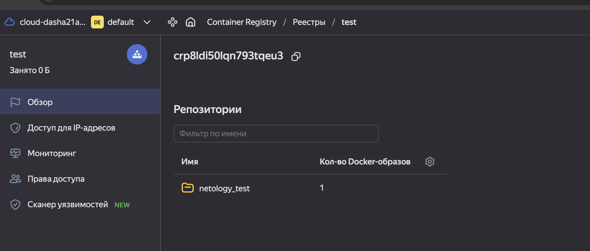
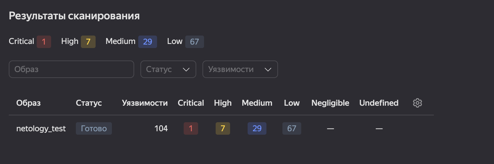
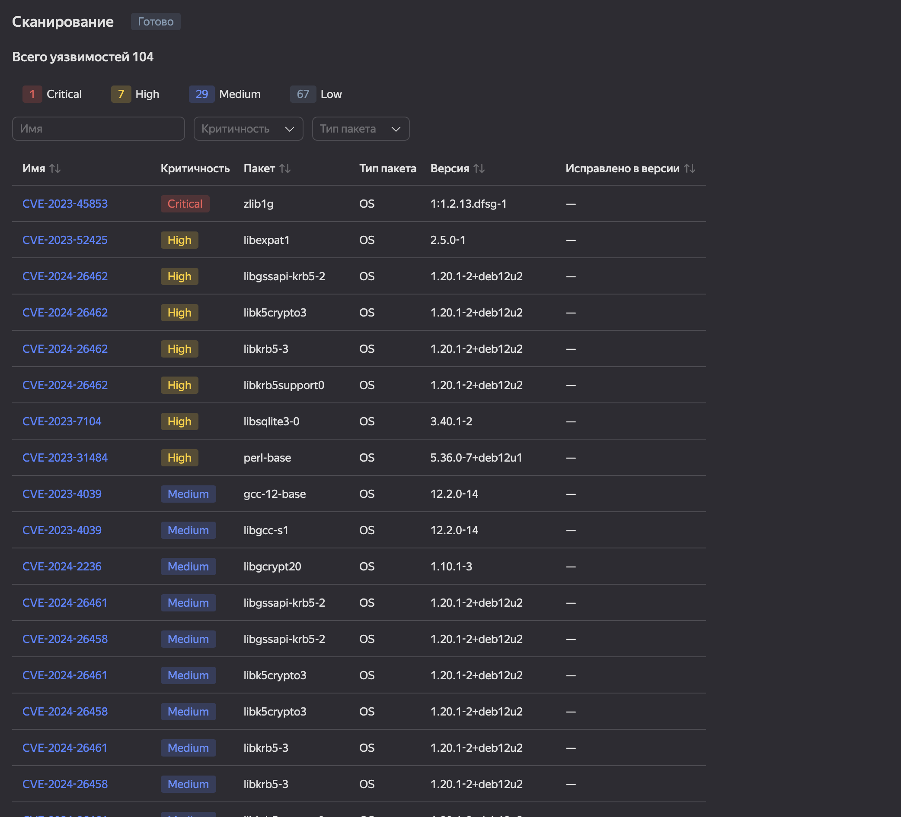
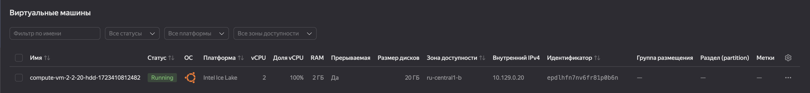
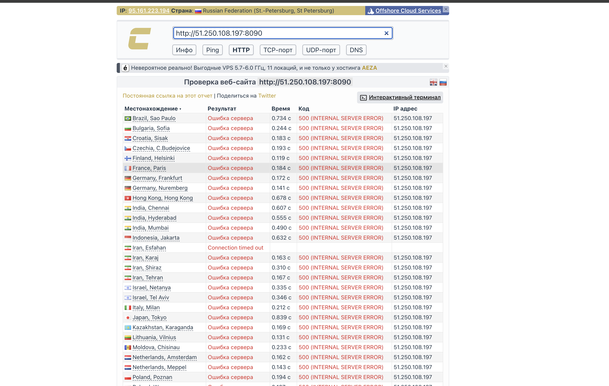

# Домашнее задание к занятию 5. «Практическое применение Docker»

### Инструкция к выполнению

1. Для выполнения заданий обязательно ознакомьтесь с [инструкцией](https://github.com/netology-code/devops-materials/blob/master/cloudwork.MD) по экономии облачных ресурсов. Это нужно, чтобы не расходовать средства, полученные в результате использования промокода.
3. **Своё решение к задачам оформите в вашем GitHub репозитории.**
4. В личном кабинете отправьте на проверку ссылку на .md-файл в вашем репозитории.
5. Сопроводите ответ необходимыми скриншотами.

---
## Примечание: Ознакомьтесь со схемой виртуального стенда [по ссылке](https://github.com/netology-code/shvirtd-example-python/blob/main/schema.pdf)

---

## Задача 0
1. Убедитесь что у вас НЕ(!) установлен ```docker-compose```, для этого получите следующую ошибку от команды ```docker-compose --version```
```
Command 'docker-compose' not found, but can be installed with:

sudo snap install docker          # version 24.0.5, or
sudo apt  install docker-compose  # version 1.25.0-1

See 'snap info docker' for additional versions.
```
В случае наличия установленного в системе ```docker-compose``` - удалите его.
2. Убедитесь что у вас УСТАНОВЛЕН ```docker compose```(без тире) версии не менее v2.24.X, для это выполните команду ```docker compose version```
###  **Своё решение к задачам оформите в вашем GitHub репозитории!!!!!!!!!!!!!!!!!!!!!!!!!!!!!!!!**

---

## Задача 1
1. Сделайте в своем github пространстве fork репозитория ```https://github.com/netology-code/shvirtd-example-python/blob/main/README.md```.
2. Создайте файл с именем ```Dockerfile.python``` для сборки данного проекта(для 3 задания изучите https://docs.docker.com/compose/compose-file/build/ ). Используйте базовый образ ```python:3.9-slim```.
Обязательно используйте конструкцию ```COPY . .``` в Dockerfile. Не забудьте исключить ненужные в имадже файлы с помощью dockerignore. Протестируйте корректность сборки.
3. (Необязательная часть, *) Изучите инструкцию в проекте и запустите web-приложение без использования docker в venv. (Mysql БД можно запустить в docker run).
4. (Необязательная часть, *) По образцу предоставленного python кода внесите в него исправление для управления названием используемой таблицы через ENV переменную.

Dockerfile:
```text
FROM python:3.9-slim
WORKDIR /app
COPY . .
RUN pip install --no-cache-dir -r requirements.txt
CMD [ "python", "main.py"]
```

Сборка образа:

docker build -f Dockerfile.python .

```log
[+] Building 40.6s (9/9) FINISHED                                                                                                                                                                                     docker:desktop-linux
 => [internal] load build definition from Dockerfile.python                                                                                                                                                                           0.0s
 => => transferring dockerfile: 164B                                                                                                                                                                                                  0.0s
 => [internal] load metadata for docker.io/library/python:3.9-slim                                                                                                                                                                    5.9s
 => [internal] load .dockerignore                                                                                                                                                                                                     0.0s
 => => transferring context: 141B                                                                                                                                                                                                     0.0s
 => [1/4] FROM docker.io/library/python:3.9-slim@sha256:85c7a2a383a01e0b77b5f9c97d8b1eef70409a99552fde03c518a98dfa19609c                                                                                                             20.8s
 => => resolve docker.io/library/python:3.9-slim@sha256:85c7a2a383a01e0b77b5f9c97d8b1eef70409a99552fde03c518a98dfa19609c                                                                                                              0.0s
 => => sha256:e2169b450365fcee13b6d35ce2fd1d11326ce808fdd9e563b591aacd66d33aa6 6.90kB / 6.90kB                                                                                                                                        0.0s
 => => sha256:262a5f25eec7a7daccd94a64695e41acca5262f481c3630ef31289616897aa40 29.16MB / 29.16MB                                                                                                                                     10.4s
 => => sha256:ba32bf0f91fccf36472f9ad3da47b1bd3638fa0c80d026ea6a6a5571ce334a12 3.33MB / 3.33MB                                                                                                                                        5.6s
 => => sha256:e161aac9bcc413c9cb1cd0b1799bd1c8df60e08b94062f709b45b08709300103 11.86MB / 11.86MB                                                                                                                                     20.3s
 => => sha256:85c7a2a383a01e0b77b5f9c97d8b1eef70409a99552fde03c518a98dfa19609c 10.41kB / 10.41kB                                                                                                                                      0.0s
 => => sha256:83560b9a2f9471942933b838b2198a5da2319cdeb48b45897acc47d7461b95d8 1.94kB / 1.94kB                                                                                                                                        0.0s
 => => sha256:67cb38e67018cabd2ea2afeaf699ac22eacb99cc8fc12ec59a47526de3c6c486 233B / 233B                                                                                                                                            6.4s
 => => sha256:656bfe61e2c88e890e8cb449548e5400c70a5e6e6085f85fc47cb4df00309f72 2.77MB / 2.77MB                                                                                                                                       10.5s
 => => extracting sha256:262a5f25eec7a7daccd94a64695e41acca5262f481c3630ef31289616897aa40                                                                                                                                             0.9s
 => => extracting sha256:ba32bf0f91fccf36472f9ad3da47b1bd3638fa0c80d026ea6a6a5571ce334a12                                                                                                                                             0.1s
 => => extracting sha256:e161aac9bcc413c9cb1cd0b1799bd1c8df60e08b94062f709b45b08709300103                                                                                                                                             0.3s
 => => extracting sha256:67cb38e67018cabd2ea2afeaf699ac22eacb99cc8fc12ec59a47526de3c6c486                                                                                                                                             0.0s
 => => extracting sha256:656bfe61e2c88e890e8cb449548e5400c70a5e6e6085f85fc47cb4df00309f72                                                                                                                                             0.1s
 => [internal] load build context                                                                                                                                                                                                     0.0s
 => => transferring context: 88.30kB                                                                                                                                                                                                  0.0s
 => [2/4] WORKDIR /app                                                                                                                                                                                                                0.1s
 => [3/4] COPY . .                                                                                                                                                                                                                    0.0s
 => [4/4] RUN pip install --no-cache-dir -r requirements.txt                                                                                                                                                                         13.6s
 => exporting to image                                                                                                                                                                                                                0.2s
 => => exporting layers                                                                                                                                                                                                               0.2s
 => => writing image sha256:af28213b8cf020411a93445c3d5da72e845469d819f712269036ffb64b999609                                                                                                                                          0.0s

```

Выполнение команды:

docker images
```log
REPOSITORY                                       TAG                IMAGE ID       CREATED         SIZE
<none>                                           <none>             af28213b8cf0   2 minutes ago   227MB
```

---
### ВНИМАНИЕ!
!!! В процессе последующего выполнения ДЗ НЕ изменяйте содержимое файлов в fork-репозитории! Ваша задача ДОБАВИТЬ 5 файлов: ```Dockerfile.python```, ```compose.yaml```, ```.gitignore```, ```.dockerignore```,```bash-скрипт```. Если вам понадобилось внести иные изменения в проект - вы что-то делаете неверно!
---

## Задача 2 (*)
1. Создайте в yandex cloud container registry с именем "test" с помощью "yc tool" . [Инструкция](https://cloud.yandex.ru/ru/docs/container-registry/quickstart/?from=int-console-help)
```log
yc container registry create --name test
done (1s)
id: ****
folder_id: ****
name: test
status: ACTIVE
created_at: "2024-08-11T20:17:19.253Z"
```

2. Настройте аутентификацию вашего локального docker в yandex container registry.
```log
yc container registry configure-docker
```
3. Соберите и залейте в него образ с python приложением из задания №1.

Изменен тег на образе
```log
docker image tag af28213b8cf0 netology_test:test
docker images
REPOSITORY                                       TAG                IMAGE ID       CREATED          SIZE
netology_test                                    test               af28213b8cf0   11 minutes ago   227MB
```

Запушить образ в registry:
```log
docker tag netology_test:test \
cr.yandex/crp8ldi50lqn793tqeu3/netology_test:test
docker push \
cr.yandex/crp8ldi50lqn793tqeu3/netology_test:test

docker push \
> cr.yandex/crp8ldi50lqn793tqeu3/netology_test:test
The push refers to repository [cr.yandex/crp8ldi50lqn793tqeu3/netology_test]
8b61dd34b5a3: Pushed
350ec74be74e: Pushed
875c68690df6: Pushed
51c4dc852db4: Pushed
4d11e961c7a1: Pushed
a912f701c37f: Pushed
68175875390f: Pushed
58007152def9: Pushed
test: digest: sha256:9d494137217cae831eb4ee74972a8923a691df22c57a14ebc6274ea631ed798e size: 1997
```
Образ запушен:

4. Просканируйте образ на уязвимости.



5. В качестве ответа приложите отчет сканирования.



## Задача 3
1. Изучите файл "proxy.yaml"
2. Создайте в репозитории с проектом файл ```compose.yaml```. С помощью директивы "include" подключите к нему файл "proxy.yaml".
3. Опишите в файле ```compose.yaml``` следующие сервисы:

- ```web```. Образ приложения должен ИЛИ собираться при запуске compose из файла ```Dockerfile.python``` ИЛИ скачиваться из yandex cloud container registry(из задание №2 со *). Контейнер должен работать в bridge-сети с названием ```backend``` и иметь фиксированный ipv4-адрес ```172.20.0.5```. Сервис должен всегда перезапускаться в случае ошибок.
Передайте необходимые ENV-переменные для подключения к Mysql базе данных по сетевому имени сервиса ```web```

- ```db```. image=mysql:8. Контейнер должен работать в bridge-сети с названием ```backend``` и иметь фиксированный ipv4-адрес ```172.20.0.10```. Явно перезапуск сервиса в случае ошибок. Передайте необходимые ENV-переменные для создания: пароля root пользователя, создания базы данных, пользователя и пароля для web-приложения.Обязательно используйте уже существующий .env file для назначения секретных ENV-переменных!

2. Запустите проект локально с помощью docker compose , добейтесь его стабильной работы: команда ```curl -L http://127.0.0.1:8090``` должна возвращать в качестве ответа время и локальный IP-адрес. Если сервисы не стартуют воспользуйтесь командами: ```docker ps -a ``` и ```docker logs <container_name>``` . Если вместо IP-адреса вы получаете ```NULL``` --убедитесь, что вы шлете запрос на порт ```8090```, а не 5000.

5. Подключитесь к БД mysql с помощью команды ```docker exec <имя_контейнера> mysql -uroot -p<пароль root-пользователя>```(обратите внимание что между ключем -u и логином root нет пробела. это важно!!! тоже самое с паролем) . Введите последовательно команды (не забываем в конце символ ; ): ```show databases; use <имя вашей базы данных(по-умолчанию example)>; show tables; SELECT * from requests LIMIT 10;```.

6. Остановите проект. В качестве ответа приложите скриншот sql-запроса.

Создан доп файл:
```log
version: '3.8'
services:

  web:
    build:
      context: .
      dockerfile: Dockerfile.python
    container_name: web_python
    restart: on-failure
    networks:
      backend:
        ipv4_address: 172.20.0.5

    depends_on:
      - reverse-proxy
      - ingress-proxy
      - db

    env_file:
      - web.env


  db:
    image: mysql:8
    container_name: db_mysql
    restart: on-failure
    networks:
      backend:
        ipv4_address: 172.20.0.10

    depends_on:
      - reverse-proxy
      - ingress-proxy

    env_file:
      - db.env


include:
  - path:
      - ./proxy.yaml

```

Файл с web переменными:
```log
MYSQL_ROOT_PASSWORD=myrootpass
MYSQL_DATABASE=task3
MYSQL_USER=kek
MYSQL_PASSWORD=kekpass
MYSQL_TABLE=mytable
```

Файл с db переменными:
```log
DB_HOST=db
DB_USER=kek
DB_PASSWORD=kekpass
DB_NAME=task3
DB_TABLE=mytable
```

Запуск файла:
```log
docker-compose -f compose.yaml up
docker ps
CONTAINER ID   IMAGE                        COMMAND                  CREATED          STATUS          PORTS                      NAMES
2b217922cb1d   shvirtd-example-python-web   "python main.py"         49 seconds ago   Up 40 seconds                              web_python
868ba177a766   mysql:8                      "docker-entrypoint.s…"   49 seconds ago   Up 48 seconds   3306/tcp, 33060/tcp        db_mysql
8a1cd38ae860   haproxy:2.4                  "docker-entrypoint.s…"   49 seconds ago   Up 49 seconds   127.0.0.1:8080->8080/tcp   shvirtd-example-python-reverse-proxy-1
d7bdb16861d8   nginx:1.21.1                 "/docker-entrypoint.…"   49 seconds ago   Up 49 seconds                              shvirtd-example-python-ingress-proxy-1
```

curl:
```log
curl -L http://localhost:8080
TIME: 2024-08-11 21:01:04, IP: None%
```

Выполнение команд внутри контейнера mysql:
```log
docker ps
CONTAINER ID   IMAGE                        COMMAND                  CREATED          STATUS          PORTS                      NAMES
2b217922cb1d   shvirtd-example-python-web   "python main.py"         15 minutes ago   Up 14 minutes                              web_python
868ba177a766   mysql:8                      "docker-entrypoint.s…"   15 minutes ago   Up 15 minutes   3306/tcp, 33060/tcp        db_mysql
8a1cd38ae860   haproxy:2.4                  "docker-entrypoint.s…"   15 minutes ago   Up 15 minutes   127.0.0.1:8080->8080/tcp   shvirtd-example-python-reverse-proxy-1
d7bdb16861d8   nginx:1.21.1                 "/docker-entrypoint.…"   15 minutes ago   Up 15 minutes                              shvirtd-example-python-ingress-proxy-1

docker exec -it db_mysql sh
sh-5.1# mysql -ukek -pkekpass
mysql: [Warning] Using a password on the command line interface can be insecure.
Welcome to the MySQL monitor.  Commands end with ; or \g.
Your MySQL connection id is 31
Server version: 8.4.2 MySQL Community Server - GPL

Copyright (c) 2000, 2024, Oracle and/or its affiliates.

Oracle is a registered trademark of Oracle Corporation and/or its
affiliates. Other names may be trademarks of their respective
owners.

Type 'help;' or '\h' for help. Type '\c' to clear the current input statement.

mysql> show databases;
+--------------------+
| Database           |
+--------------------+
| information_schema |
| performance_schema |
| task3              |
+--------------------+
3 rows in set (0.01 sec)

mysql> use task3;
Reading table information for completion of table and column names
You can turn off this feature to get a quicker startup with -A

Database changed
mysql> show tables;
+-----------------+
| Tables_in_task3 |
+-----------------+
| requests        |
+-----------------+
1 row in set (0.00 sec)

mysql> SELECT * from requests LIMIT 10;
+----+---------------------+------------+
| id | request_date        | request_ip |
+----+---------------------+------------+
|  1 | 2024-08-11 20:58:46 | NULL       |
|  2 | 2024-08-11 21:01:04 | NULL       |
+----+---------------------+------------+
2 rows in set (0.00 sec)

mysql>

```

Остановить docker-compose:
```log
docker compose down
[+] Running 5/4
 ✔ Container web_python                              Removed                                                                                                                                                                          0.1s
 ✔ Container db_mysql                                Removed                                                                                                                                                                          1.4s
 ✔ Container shvirtd-example-python-reverse-proxy-1  Removed                                                                                                                                                                          1.2s
 ✔ Container shvirtd-example-python-ingress-proxy-1  Removed                                                                                                                                                                          0.1s
 ✔ Network shvirtd-example-python_backend            Removed
```

## Задача 4
1. Запустите в Yandex Cloud ВМ (вам хватит 2 Гб Ram).

ВМ создана:


2. Подключитесь к Вм по ssh и установите docker.

```log
ssh dasha21a@51.250.108.197

dasha21a@compute-vm-2-2-20-hdd-1723410812482:~$ sudo snap install docker
2024-08-11T21:18:55Z INFO Waiting for automatic snapd restart...
docker 24.0.5 from Canonical✓ installed
dasha21a@compute-vm-2-2-20-hdd-1723410812482:~$ docker version
Client:
 Version:           24.0.5
 API version:       1.43
 Go version:        go1.20.8
 Git commit:        ced0996
 Built:             Sat Oct  7 00:14:00 2023
 OS/Arch:           linux/amd64
 Context:           default

```
3. Напишите bash-скрипт, который скачает ваш fork-репозиторий в каталог /opt и запустит проект целиком.

Скрипт:
```log
#!/bin/bash

git clone https://github.com/netology-code/shvirtd-example-python

cd shvirtd-example-python

cat << EOF > .dockerignore
/haproxy
/nginx
.gitignore
compose.yaml
LICENCE
proxy.yaml
schema.pdf
README.md
.dockerignore
EOF

cat << EOF > .dockerignore

EOF

cat << EOF > .env
MYSQL_ROOT_PASSWORD="kekpass"

MYSQL_DATABASE="virtd"
MYSQL_USER="kek"
MYSQL_PASSWORD="kekpass"
EOF

cat << EOF > Dockerfile
FROM python:3.9-slim
WORKDIR /app
COPY . .
RUN pip install --no-cache-dir -r requirements.txt
CMD [ "python", "main.py"]
EOF

cat << EOF > compose.yaml
version: "3"
include:
  - proxy.yaml
services:
  db:
    image: mysql:8
    restart: always
    networks:
      backend:
        ipv4_address: 172.20.0.10
    env_file:
      - .env
    volumes:
      - ./data:/var/lib/mysql

  web:
    depends_on: ["db"]
    build: .
    restart: always
    networks:
      backend:
        ipv4_address: 172.20.0.5
    environment:
      - DB_HOST=172.20.0.10
      - DB_USER=kek
      - DB_PASSWORD=kekpass
      - DB_NAME=virtd
EOF

docker compose up -d

```
```log
dasha21a@compute-vm-2-2-20-hdd-1723410812482:~/shvirtd-example-python$ sudo sh run.sh
[+] Running 24/3
 ✔ ingress-proxy 6 layers [⣿⣿⣿⣿⣿⣿]      0B/0B      Pulled                                                                                                                                                                            14.2s
 ✔ db 10 layers [⣿⣿⣿⣿⣿⣿⣿⣿⣿⣿]      0B/0B      Pulled                                                                                                                                                                                  21.2s
 ✔ reverse-proxy 5 layers [⣿⣿⣿⣿⣿]      0B/0B      Pulled                                                                                                                                                                             13.3s
[+] Building 15.0s (9/9) FINISHED                                                                                                                                                                                           docker:default
 => [web internal] load build definition from Dockerfile                                                                                                                                                                              0.1s
 => => transferring dockerfile: 158B                                                                                                                                                                                                  0.0s
 => [web internal] load .dockerignore                                                                                                                                                                                                 0.1s
 => => transferring context: 41B                                                                                                                                                                                                      0.0s
 => [web internal] load metadata for docker.io/library/python:3.9-slim                                                                                                                                                                2.6s
 => [web 1/4] FROM docker.io/library/python:3.9-slim@sha256:85c7a2a383a01e0b77b5f9c97d8b1eef70409a99552fde03c518a98dfa19609c                                                                                                          2.2s
 => => resolve docker.io/library/python:3.9-slim@sha256:85c7a2a383a01e0b77b5f9c97d8b1eef70409a99552fde03c518a98dfa19609c                                                                                                              0.0s
 => => sha256:c87f9801692e4bdc9e1d19fac4be5f124c44c8aa0f5260209b8c18ee94646224 3.51MB / 3.51MB                                                                                                                                        0.5s
 => => sha256:5ad7287a1ddf6c0381d529d7360e2565d22f02b503acc240ba4e0b4427b6c5be 11.89MB / 11.89MB                                                                                                                                      0.8s
 => => sha256:a3d3ef1ae64a2defc21b804c81691d6928880ef0cde0fe750a1f8ce6de87f81b 233B / 233B                                                                                                                                            0.5s
 => => sha256:85c7a2a383a01e0b77b5f9c97d8b1eef70409a99552fde03c518a98dfa19609c 10.41kB / 10.41kB                                                                                                                                      0.0s
 => => sha256:d433bca818eca04fef21ac9e5e2bff7226169ad1cb4ae5380892205e1286defc 1.94kB / 1.94kB                                                                                                                                        0.0s
 => => sha256:c21985b6cbb254ab1c851bfcfd40a34e84205ec572f5a418376d1613f2b1255f 6.90kB / 6.90kB                                                                                                                                        0.0s
 => => extracting sha256:c87f9801692e4bdc9e1d19fac4be5f124c44c8aa0f5260209b8c18ee94646224                                                                                                                                             0.1s
 => => extracting sha256:5ad7287a1ddf6c0381d529d7360e2565d22f02b503acc240ba4e0b4427b6c5be                                                                                                                                             0.6s
 => => sha256:54c8e329ac5ee70923b0299f6432daf03b1ad22ed1c6d77eba8c54b0742f4825 2.77MB / 2.77MB                                                                                                                                        1.1s
 => => extracting sha256:a3d3ef1ae64a2defc21b804c81691d6928880ef0cde0fe750a1f8ce6de87f81b                                                                                                                                             0.0s
 => => extracting sha256:54c8e329ac5ee70923b0299f6432daf03b1ad22ed1c6d77eba8c54b0742f4825                                                                                                                                             0.2s
 => [web internal] load build context                                                                                                                                                                                                 0.1s
 => => transferring context: 155.21kB                                                                                                                                                                                                 0.0s
 => [web 2/4] WORKDIR /app                                                                                                                                                                                                            2.1s
 => [web 3/4] COPY . .                                                                                                                                                                                                                0.1s
 => [web 4/4] RUN pip install --no-cache-dir -r requirements.txt                                                                                                                                                                      7.0s
 => [web] exporting to image                                                                                                                                                                                                          0.6s
 => => exporting layers                                                                                                                                                                                                               0.6s
 => => writing image sha256:81b7b41aad5db26df308ca9df9bbec9d26b8d52b23355763ade63b1a67684262                                                                                                                                          0.0s
 => => naming to docker.io/library/shvirtd-example-python-web                                                                                                                                                                         0.0s
[+] Running 5/5
 ✔ Network shvirtd-example-python_backend            Created                                                                                                                                                                          0.4s
 ✔ Container shvirtd-example-python-ingress-proxy-1  Started                                                                                                                                                                          0.1s
 ✔ Container shvirtd-example-python-db-1             Started                                                                                                                                                                          0.1s
 ✔ Container shvirtd-example-python-reverse-proxy-1  Started                                                                                                                                                                          0.1s
 ✔ Container shvirtd-example-python-web-1            Started
dasha21a@compute-vm-2-2-20-hdd-1723410812482:~/shvirtd-example-python$ sudo docker ps
CONTAINER ID   IMAGE                        COMMAND                  CREATED          STATUS                          PORTS                      NAMES
9c1fba301790   shvirtd-example-python-web   "python main.py"         55 seconds ago   Restarting (1) 21 seconds ago                              shvirtd-example-python-web-1
848d0be2b6fb   haproxy:2.4                  "docker-entrypoint.s…"   56 seconds ago   Up 53 seconds                   127.0.0.1:8080->8080/tcp   shvirtd-example-python-reverse-proxy-1
ad5f8c9d433f   nginx:1.21.1                 "/docker-entrypoint.…"   56 seconds ago   Up 53 seconds                                              shvirtd-example-python-ingress-proxy-1
499c5b9b9c76   mysql:8                      "docker-entrypoint.s…"   56 seconds ago   Up 53 seconds                   3306/tcp, 33060/tcp        shvirtd-example-python-db-1

```
4. Зайдите на сайт проверки http подключений, например(или аналогичный): ```https://check-host.net/check-http``` и запустите проверку вашего сервиса ```http://<внешний_IP-адрес_вашей_ВМ>:8090```. Таким образом трафик будет направлен в ingress-proxy. ПРИМЕЧАНИЕ: Приложение весьма вероятно упадет под нагрузкой, но успеет обработать часть запросов - этого достаточно.


5. (Необязательная часть) Дополнительно настройте remote ssh context к вашему серверу. Отобразите список контекстов и результат удаленного выполнения ```docker ps -a```
6. В качестве ответа повторите  sql-запрос и приложите скриншот с данного сервера, bash-скрипт и ссылку на fork-репозиторий.

```log
sh-5.1# mysql -ukek -pkekpass
mysql: [Warning] Using a password on the command line interface can be insecure.
Welcome to the MySQL monitor.  Commands end with ; or \g.
Your MySQL connection id is 11
Server version: 8.4.2 MySQL Community Server - GPL

Copyright (c) 2000, 2024, Oracle and/or its affiliates.

Oracle is a registered trademark of Oracle Corporation and/or its
affiliates. Other names may be trademarks of their respective
owners.

Type 'help;' or '\h' for help. Type '\c' to clear the current input statement.

mysql> show databases;
+--------------------+
| Database           |
+--------------------+
| information_schema |
| performance_schema |
| virtd              |
+--------------------+
3 rows in set (0.04 sec)

mysql> use virtd;
Reading table information for completion of table and column names
You can turn off this feature to get a quicker startup with -A

Database changed
mysql> show tables;
+-----------------+
| Tables_in_virtd |
+-----------------+
| requests        |
+-----------------+
1 row in set (0.00 sec)

mysql> SELECT * from requests LIMIT 10;
+----+---------------------+-----------------+
| id | request_date        | request_ip      |
+----+---------------------+-----------------+
|  1 | 2024-08-11 21:28:39 | 167.235.135.184 |
|  2 | 2024-08-11 21:28:39 | 195.211.27.85   |
+----+---------------------+-----------------+
2 rows in set (0.00 sec)

mysql> exit
Bye
sh-5.1# exit
exit
dasha21a@compute-vm-2-2-20-hdd-1723410812482:~/shvirtd-example-python$

```
## Задача 5 (*)
1. Напишите и задеплойте на вашу облачную ВМ bash скрипт, который произведет резервное копирование БД mysql в директорию "/opt/backup" с помощью запуска в сети "backend" контейнера из образа ```schnitzler/mysqldump``` при помощи ```docker run ...``` команды. Подсказка: "документация образа."
2. Протестируйте ручной запуск
3. Настройте выполнение скрипта раз в 1 минуту через cron, crontab или systemctl timer. Придумайте способ не светить логин/пароль в git!!
4. Предоставьте скрипт, cron-task и скриншот с несколькими резервными копиями в "/opt/backup"

## Задача 6
Скачайте docker образ ```hashicorp/terraform:latest``` и скопируйте бинарный файл ```/bin/terraform``` на свою локальную машину, используя dive и docker save.
Предоставьте скриншоты  действий .

```log
dasha21a@compute-vm-2-2-20-hdd-1723410812482:~$ sudo docker images
REPOSITORY                   TAG       IMAGE ID       CREATED          SIZE
shvirtd-example-python-web   latest    81b7b41aad5d   18 minutes ago   199MB
hashicorp/terraform          latest    c1a60532df99   4 days ago       115MB
mysql                        8         233a484acc79   2 weeks ago      583MB
haproxy                      2.4       5ed1d96014b1   7 weeks ago      99.2MB
nginx                        1.21.1    822b7ec2aaf2   2 years ago      133MB
dasha21a@compute-vm-2-2-20-hdd-1723410812482:~$ sudo docker image save hashicorp/terraform | tar --extract --wildcards --to-stdout '*/layer.tar' | tar --extract --ignore-zeros --verbose bin/terraform
bin/terraform
dasha21a@compute-vm-2-2-20-hdd-1723410812482:~$ ll bin
total 86932
drwxrwxr-x 2 dasha21a dasha21a     4096 Aug 11 21:46 ./
drwxr-x--- 8 dasha21a dasha21a     4096 Aug 11 21:46 ../
-rwxr-xr-x 1 dasha21a dasha21a 89006232 Aug  7 06:43 terraform*
dasha21a@compute-vm-2-2-20-hdd-1723410812482:~$
```
## Задача 6.1
Добейтесь аналогичного результата, используя docker cp.
Предоставьте скриншоты  действий .

```log
dasha21a@compute-vm-2-2-20-hdd-1723410812482:~$ sudo docker create --name terraform01 hashicorp/terraform
953ebd7a6409d32cbd9733a12dede54da5a01d6d81c64a5e1658553669d51640
dasha21a@compute-vm-2-2-20-hdd-1723410812482:~$ sudo docker cp terraform01:/bin/terraform ./
                                               Successfully copied 32.8kB to /home/dasha21a/./

```
## Задача 6.2 (**)
Предложите способ извлечь файл из контейнера, используя только команду docker build и любой Dockerfile.
Предоставьте скриншоты  действий .

## Задача 7 (***)
Запустите ваше python-приложение с помощью runC, не используя docker или containerd.
Предоставьте скриншоты  действий .