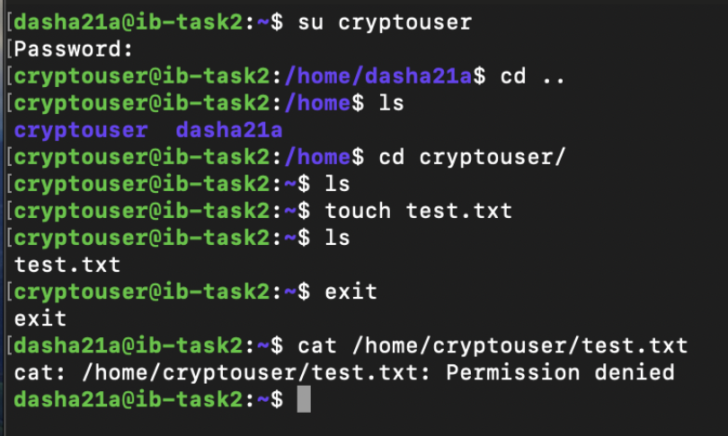
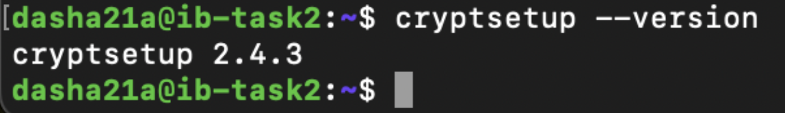
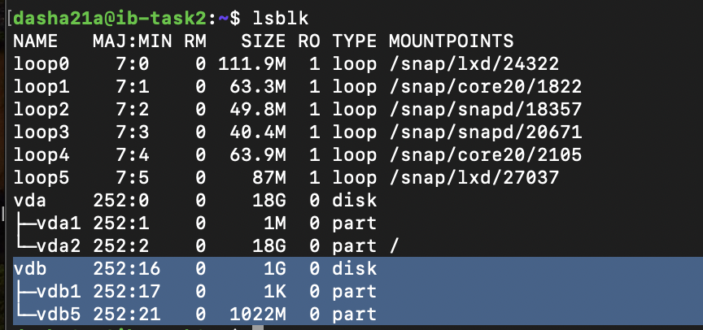
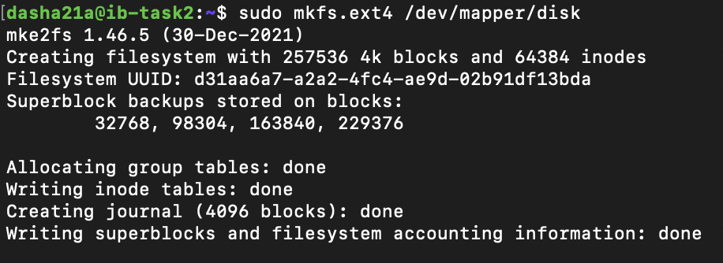
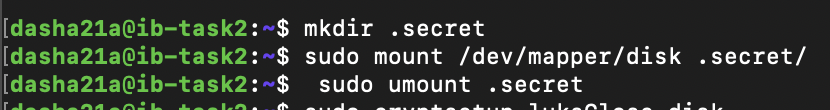

# Домашнее задание к занятию  «Защита хоста»

------

### Задание 1

1. Установите **eCryptfs**.
2. Добавьте пользователя cryptouser.
3. Зашифруйте домашний каталог пользователя с помощью eCryptfs.


*В качестве ответа  пришлите снимки экрана домашнего каталога пользователя с исходными и зашифрованными данными.*

1. Установка **eCryptfs**
    ```bash
    sudo apt install ecryptfs-utils
    ```

2. Добавление пользователя
    ```bash
    sudo adduser --encrypt-home cryptouser
    ```

3. Проверяем что в домашний католог cryptouser никто больше писать не может
    
    


### Задание 2

1. Установите поддержку **LUKS**.
2. Создайте небольшой раздел, например, 100 Мб.
3. Зашифруйте созданный раздел с помощью LUKS.

*В качестве ответа пришлите снимки экрана с поэтапным выполнением задания.*

1. Проверяем что LUKS установлен:
    ```bash
    cryptsetup --version
    ```
    

2. Создаем диск на 1 Гб и раздел на 1022 Мб
   

   1. Шифруем созданный раздел с помощью LUKS
      1. Подготавливаем раздел
          ```bash
            sudo cryptsetup -y -v --type luks2 luksFormat /dev/vdb5
          ```
      2. Монтируем раздел
          ```bash
            sudo cryptsetup luksOpen /dev/vdb5 disk
          ```
      3. Форматируем раздел
          ```bash
            sudo cryptsetup luksOpen /dev/vdb5 disk
            sudo mkfs.ext4 /dev/mapper/disk 
          ```
         
      4. Монтирование «открытого» раздела:
          ```bash
             mkdir .secret
             sudo mount /dev/mapper/disk .secret/
         ```
         
      5. Завершение работы:
         ```bash
            sudo umount .secret
            sudo cryptsetup luksClose disk
         ```