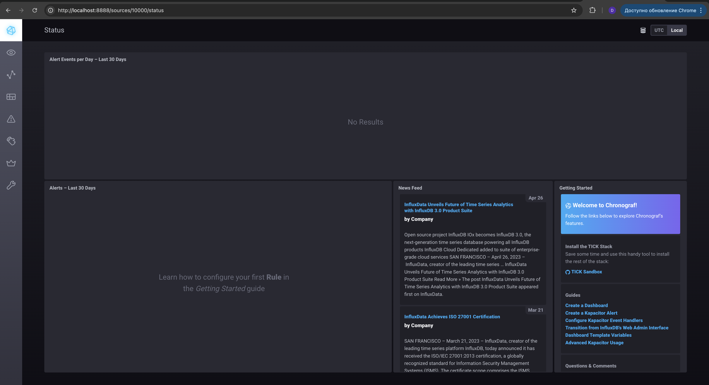

# Домашнее задание к занятию "13.Системы мониторинга"

## Обязательные задания

1. Вас пригласили настроить мониторинг на проект. На онбординге вам рассказали, что проект представляет из себя
   платформу для вычислений с выдачей текстовых отчетов, которые сохраняются на диск. Взаимодействие с платформой
   осуществляется по протоколу http. Также вам отметили, что вычисления загружают ЦПУ. Какой минимальный набор метрик вы
   выведите в мониторинг и почему?

```
Метрики подсчета запросов:
  1. Количество HTTP/S запросов к приложению
  2. Процент корректных ответов <400 кода
  3. Доступность ПО из разных регионов
  4. Количество успешно выданных запросов
  5. Среднее время формирования запросов
  6. Количество ошибок по отчетам

Инфраструктурные:
  1. CPU - загрузка ЦПУ 
  2. RAM - количество занятой и оставшейся памяти
  3. HDD - нагрузка на диск, свободное место, состояние диска, динамика заполняемости диска
  5. ОЗУ - объем свободного ОЗУ
```

2. Менеджер продукта посмотрев на ваши метрики сказал, что ему непонятно что такое RAM/inodes/CPUla. Также он сказал,
   что хочет понимать, насколько мы выполняем свои обязанности перед клиентами и какое качество обслуживания. Что вы
   можете ему предложить?

```
RAM - загруженность оперативной памяти
inodes - загруженность файловой системы 
CPUla - показатель загруженности CPU

Нужно утвердить SLA в рамках, которого будут указаны SLO метрик, после чего менежджеру будет видна понятная разница между значениями SLO и SLI.
Если значения SLI метрики не противоречат установленным SLO - продукт ОК.
```

3. Вашей DevOps команде в этом году не выделили финансирование на построение системы сбора логов. Разработчики в свою
   очередь хотят видеть все ошибки, которые выдают их приложения. Какое решение вы можете предпринять в этой ситуации,
   чтобы разработчики получали ошибки приложения?

```
Использовать ELK
```

4. Вы, как опытный SRE, сделали мониторинг, куда вывели отображения выполнения SLA=99% по http кодам ответов.
   Вычисляете этот параметр по следующей формуле: summ_2xx_requests/summ_all_requests. Данный параметр не поднимается выше
   70%, но при этом в вашей системе нет кодов ответа 5xx и 4xx. Где у вас ошибка?

```
Лучше использовать формулу SLI = (summ_1x_requests + summ_2x_requests + summ_3x_requests)/(summ_all_requests)  
```

5. Опишите основные плюсы и минусы pull и push систем мониторинга.

```text
pull-модель:
Плюсы:
    - Не требуется настройка агентов и их ассоциация с сервером
    - Упрощение настройки
    - Можно настроить единый proxy сервер для мониторинга всех хостов
Минусы:
    - Возрастает нагрузка на сервер и сеть из-за опроса хостов
    - Высокие требования к ресурсам и надежности самой системы мониторинга

push-модель:
Плюсы:
    - Настройка каждого агента может быть индивидуальной и более тонкой
    - Меньшая нагрузка на сервер
    - Чаще используется UDP, как менее затратный транспортный протокол
Минусы:
    - Необходимо использовать и настраивать агент
    - Объект мониторинга как правило не имеет обратной связи от сервера системы мониторинга

```

6. Какие из ниже перечисленных систем относятся к push модели, а какие к pull? А может есть гибридные?

    - Prometheus
    - TICK
    - Zabbix
    - VictoriaMetrics
    - Nagios

```text
pull-модель:
    - Prometheus
    - Zabbix
    - Nagios
  
push-модель:
    - TICK
    - Zabbix
    - VictoriaMetrics
```

7. Склонируйте себе [репозиторий](https://github.com/influxdata/sandbox/tree/master) и запустите TICK-стэк,
   используя технологии docker и docker-compose.

В виде решения на это упражнение приведите скриншот веб-интерфейса ПО chronograf (`http://localhost:8888`).

P.S.: если при запуске некоторые контейнеры будут падать с ошибкой - проставьте им режим `Z`, например
`./data:/var/lib:Z`

Скриншоты:




```text
daracvetkova@192-168-1-120 sandbox % docker ps
CONTAINER ID   IMAGE                   COMMAND                  CREATED         STATUS         PORTS                                                                    NAMES
2e3477de5380   chrono_config           "/entrypoint.sh chro…"   3 minutes ago   Up 3 minutes   0.0.0.0:8888->8888/tcp                                                   sandbox-chronograf-1
58569f5ddf41   kapacitor               "/entrypoint.sh kapa…"   3 minutes ago   Up 3 minutes   0.0.0.0:9092->9092/tcp                                                   sandbox-kapacitor-1
187c7486fc96   telegraf                "/entrypoint.sh tele…"   3 minutes ago   Up 3 minutes   8092/udp, 8125/udp, 8094/tcp                                             sandbox-telegraf-1
9d40b3764d17   influxdb                "/entrypoint.sh infl…"   3 minutes ago   Up 3 minutes   0.0.0.0:8082->8082/tcp, 0.0.0.0:8086->8086/tcp, 0.0.0.0:8089->8089/udp   sandbox-influxdb-1
dd586f23a155   sandbox-documentation   "/documentation/docu…"   3 minutes ago   Up 3 minutes   0.0.0.0:3010->3000/tcp                                                   sandbox-documentation-1
```

8. Перейдите в веб-интерфейс Chronograf (http://localhost:8888) и откройте вкладку Data explorer.

    - Нажмите на кнопку Add a query
    - Изучите вывод интерфейса и выберите БД telegraf.autogen
    - В `measurments` выберите cpu->host->telegraf-getting-started, а в `fields` выберите usage_system. Внизу появится график утилизации cpu.
    - Вверху вы можете увидеть запрос, аналогичный SQL-синтаксису. Поэкспериментируйте с запросом, попробуйте изменить группировку и интервал наблюдений.

Для выполнения задания приведите скриншот с отображением метрик утилизации cpu из веб-интерфейса.


9. Изучите список [telegraf inputs](https://github.com/influxdata/telegraf/tree/master/plugins/inputs).
   Добавьте в конфигурацию telegraf следующий плагин - [docker](https://github.com/influxdata/telegraf/tree/master/plugins/inputs/docker):
```
[[inputs.docker]]
  endpoint = "unix:///var/run/docker.sock"
```

Дополнительно вам может потребоваться донастройка контейнера telegraf в `docker-compose.yml` дополнительного volume и
режима privileged:
```
  telegraf:
    image: telegraf:1.4.0
    privileged: true
    volumes:
      - ./etc/telegraf.conf:/etc/telegraf/telegraf.conf:Z
      - /var/run/docker.sock:/var/run/docker.sock:Z
    links:
      - influxdb
    ports:
      - "8092:8092/udp"
      - "8094:8094"
      - "8125:8125/udp"
```

После настройке перезапустите telegraf, обновите веб интерфейс и приведите скриншотом список `measurments` в
веб-интерфейсе базы telegraf.autogen . Там должны появиться метрики, связанные с docker.

Факультативно можете изучить какие метрики собирает telegraf после выполнения данного задания.


### Как оформить ДЗ?

Выполненное домашнее задание пришлите ссылкой на .md-файл в вашем репозитории.

---
