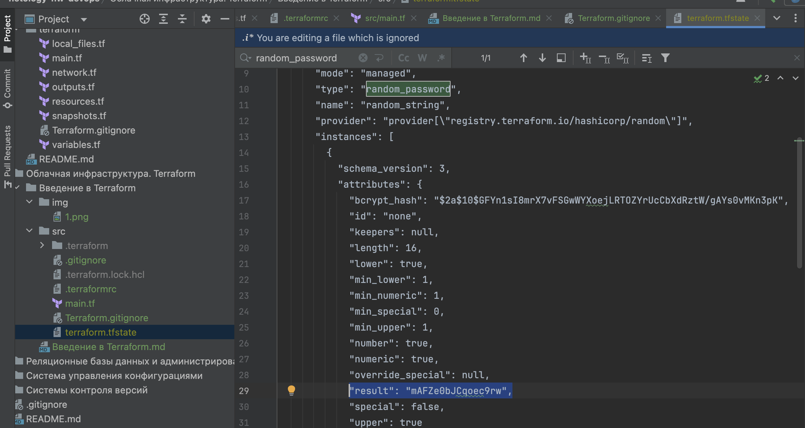
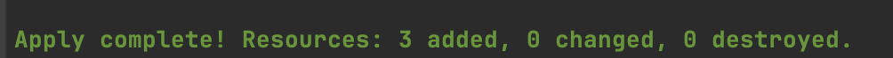

# Домашнее задание к занятию «Введение в Terraform»

### Цели задания

1. Установить и настроить Terrafrom.
2. Научиться использовать готовый код.

------

### Чек-лист готовности к домашнему заданию

1. Скачайте и установите **Terraform** версии ~>1.8.4 . Приложите скриншот вывода команды ```terraform --version```.
```text
daracvetkova@192-168-1-120 ~ % terraform --version
Terraform v1.9.5
on darwin_arm64
```
2. Скачайте на свой ПК этот git-репозиторий. Исходный код для выполнения задания расположен в директории **01/src**.
3. Убедитесь, что в вашей ОС установлен docker.

------

### Инструменты и дополнительные материалы, которые пригодятся для выполнения задания

1. Репозиторий с ссылкой на зеркало для установки и настройки Terraform: [ссылка](https://github.com/netology-code/devops-materials).
2. Установка docker: [ссылка](https://docs.docker.com/engine/install/ubuntu/).
------
### Внимание!! Обязательно предоставляем на проверку получившийся код в виде ссылки на ваш github-репозиторий!
------

### Задание 1

1. Перейдите в каталог [**src**](https://github.com/netology-code/ter-homeworks/tree/main/01/src). Скачайте все необходимые зависимости, использованные в проекте.
2. Изучите файл **.gitignore**. В каком terraform-файле, согласно этому .gitignore, допустимо сохранить личную, секретную информацию?(логины,пароли,ключи,токены итд)
```text
Недопустимо хранить личную информацию, поэтому создан Terraform.gitignore файл

Дополнительно в файле .gitignore присутствует:
# own secret vars store.
personal.auto.tfvars

```
3. Выполните код проекта. Найдите  в state-файле секретное содержимое созданного ресурса **random_password**, пришлите в качестве ответа конкретный ключ и его значение.

Скриншот:


```text
"result": "mAFZe0bJCqoec9rw"
```

4. Раскомментируйте блок кода, примерно расположенный на строчках 29–42 файла **main.tf**.
   Выполните команду ```terraform validate```. Объясните, в чём заключаются намеренно допущенные ошибки. Исправьте их.

Ошибки:
1. Отсутствует наименование ресурса у docker_image -> переименовала на nginx_image
2. Невалидное наименование ресурса у 1nginx -> переименовала на nginx_container
3. Отсутствие переменной nginx.image_id -> определила наименование ресурса docker_image, теперь docker_image.nginx_image.image_id
4. Отсутствие переменной random_string_FAKE.resulT -> определила наименование ресурса random_password, теперь "example_${random_password.random_string.result}"

```text
daracvetkova@192-168-1-120 src % terraform validate
╷
│ Error: Missing name for resource
│ 
│   on main.tf line 24, in resource "docker_image":
│   24: resource "docker_image" {
│ 
│ All resource blocks must have 2 labels (type, name).
╵
╷
│ Error: Invalid resource name
│ 
│   on main.tf line 29, in resource "docker_container" "1nginx":
│   29: resource "docker_container" "1nginx" {
│ 
│ A name must start with a letter or underscore and may contain only letters, digits, underscores, and dashes.
╵
```

После исправления лог:
```text
daracvetkova@192-168-1-120 src % terraform validate
Success! The configuration is valid.
```
5. Выполните код. В качестве ответа приложите: исправленный фрагмент кода и вывод команды ```docker ps```.

Скриншот:


```text
daracvetkova@192-168-1-120 docker ps
CONTAINER ID   IMAGE          COMMAND                  CREATED          STATUS          PORTS                  NAMES
98b2cf8273d1   5ef79149e0ec   "/docker-entrypoint.…"   43 seconds ago   Up 40 seconds   0.0.0.0:9090->80/tcp   example_rDlgsuH217Ic3jXq
```
6. Замените имя docker-контейнера в блоке кода на ```hello_world```. Не перепутайте имя контейнера и имя образа. Мы всё ещё продолжаем использовать name = "nginx:latest". Выполните команду ```terraform apply -auto-approve```.
   Объясните своими словами, в чём может быть опасность применения ключа  ```-auto-approve```. Догадайтесь или нагуглите зачем может пригодиться данный ключ? В качестве ответа дополнительно приложите вывод команды ```docker ps```.

-auto-approve возможность дать Terraform указание применить план, не запрашивая подтверждения.


```text
daracvetkova@192-168-1-120 sudo docker ps
CONTAINER ID   IMAGE          COMMAND                  CREATED              STATUS              PORTS                  NAMES
def4ea3793fa   5ef79149e0ec   "/docker-entrypoint.…"   About a minute ago   Up About a minute   0.0.0.0:9090->80/tcp   hello_world
```
8. Уничтожьте созданные ресурсы с помощью **terraform**. Убедитесь, что все ресурсы удалены. Приложите содержимое файла **terraform.tfstate**.
```text
Destroy complete! Resources: 3 destroyed.
```

Содержимое файла **terraform.tfstate**
```text
{
  "version": 4,
  "terraform_version": "1.9.4",
  "serial": 13,
  "lineage": "f0fb4272-dab5-b5b3-ea47-8bd1bce26e39",
  "outputs": {},
  "resources": [],
  "check_results": null
}
```
9. Объясните, почему при этом не был удалён docker-образ **nginx:latest**. Ответ **ОБЯЗАТЕЛЬНО НАЙДИТЕ В ПРЕДОСТАВЛЕННОМ КОДЕ**, а затем **ОБЯЗАТЕЛЬНО ПОДКРЕПИТЕ** строчкой из документации [**terraform провайдера docker**](https://docs.comcloud.xyz/providers/kreuzwerker/docker/latest/docs).  (ищите в классификаторе resource docker_image )
keep_locally параметр указывает Terraform не удалять локальную копию образа после успешного применения конфигурации. 

Argument Reference:

```text
- **keep_locally (Optional)** (boolean)
  - If true, and the Docker Image already exists locally, then the image is not pulled.
  - Defaults to `false`. This is useful for speeding up local development.
```

Cледовательно, Terraform не будет удалять образ, если keep_locally = true

```
### Правила приёма работы

Домашняя работа оформляется в отдельном GitHub-репозитории в файле README.md.   
Выполненное домашнее задание пришлите ссылкой на .md-файл в вашем репозитории.

### Критерии оценки

Зачёт ставится, если:

* выполнены все задания,
* ответы даны в развёрнутой форме,
* приложены соответствующие скриншоты и файлы проекта,
* в выполненных заданиях нет противоречий и нарушения логики.

На доработку работу отправят, если:

* задание выполнено частично или не выполнено вообще,
* в логике выполнения заданий есть противоречия и существенные недостатки. 
