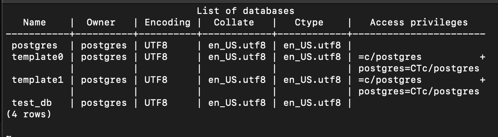
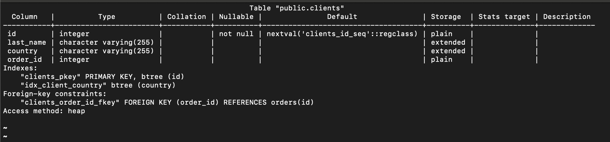
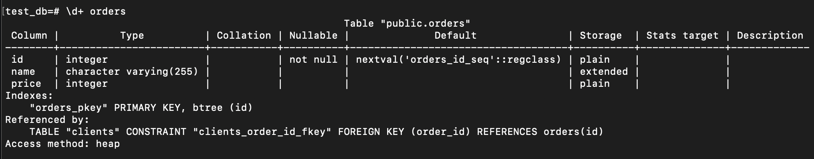
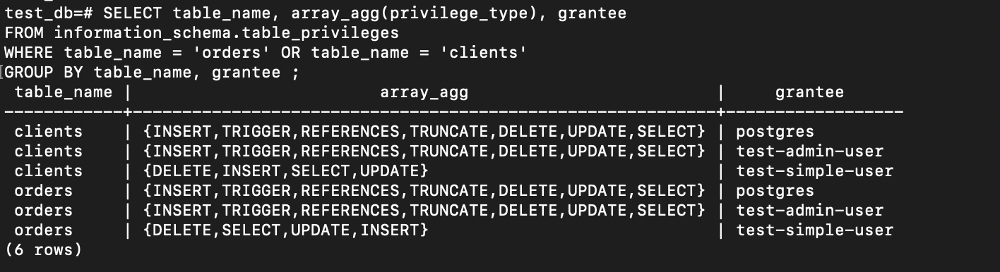

# Домашнее задание к занятию 2. «SQL»

## Введение

Перед выполнением задания вы можете ознакомиться с
[дополнительными материалами](https://github.com/netology-code/virt-homeworks/blob/virt-11/additional/README.md).

## Задача 1

Используя Docker, поднимите инстанс PostgreSQL (версию 12) c 2 volume,
в который будут складываться данные БД и бэкапы.

Приведите получившуюся команду или docker-compose-манифест.

[docker-compose.yaml](docker/docker-compose.yaml)
## Задача 2

В БД из задачи 1:

- создайте пользователя test-admin-user и БД test_db;

```sql
test_db=# create user "test-admin-user" with password 'postgres';
CREATE ROLE
test_db=# CREATE DATABASE test_db;
CREATE DATABASE
test_db=#
```
- в БД test_db создайте таблицу orders и clients (спeцификация таблиц ниже);
```sql
test_db=# CREATE TABLE orders
           (
               id    SERIAL PRIMARY KEY,
               name  VARCHAR(255),
               price INT
           );
CREATE TABLE

test_db=# CREATE TABLE clients
(
    id        SERIAL PRIMARY KEY,
    last_name VARCHAR(255),
    country   VARCHAR(255),
    order_id  INT REFERENCES orders (id)
    );
CREATE TABLE

test_db=#  CREATE INDEX idx_client_country ON clients (country);
CREATE INDEX
```
- предоставьте привилегии на все операции пользователю test-admin-user на таблицы БД test_db;
```sql
test_db=# GRANT ALL ON TABLE clients, orders TO "test-admin-user";
GRANT
```
- создайте пользователя test-simple-user;
```sql
test_db=# create user "test-simple-user" with password 'postgres';
CREATE ROLE
```
- предоставьте пользователю test-simple-user права на SELECT/INSERT/UPDATE/DELETE этих таблиц БД test_db.
```sql
test_db=# GRANT SELECT,INSERT,UPDATE,DELETE ON TABLE clients,orders TO "test-simple-user";
GRANT
```
Таблица orders:

- id (serial primary key);
- наименование (string);
- цена (integer).

Таблица clients:

- id (serial primary key);
- фамилия (string);
- страна проживания (string, index);
- заказ (foreign key orders).

Приведите:

- итоговый список БД после выполнения пунктов выше;

- описание таблиц (describe);


- SQL-запрос для выдачи списка пользователей с правами над таблицами test_db;
```sql
SELECT table_name, array_agg(privilege_type), grantee
FROM information_schema.table_privileges
WHERE table_name = 'orders'
   OR table_name = 'clients'
GROUP BY table_name, grantee;
```
- список пользователей с правами над таблицами test_db.

## Задача 3

Используя SQL-синтаксис, наполните таблицы следующими тестовыми данными:

Таблица orders

|Наименование|цена|
|------------|----|
|Шоколад| 10 |
|Принтер| 3000 |
|Книга| 500 |
|Монитор| 7000|
|Гитара| 4000|

```sql
test_db=# INSERT INTO orders (name, price)
VALUES 
    ('Шоколад', 10),
    ('Принтер', 3000),
    ('Книга', 500),
    ('Монитор', 7000),
    ('Гитара', 4000)
;
INSERT 0 5
```
Таблица clients

|ФИО|Страна проживания|
|------------|----|
|Иванов Иван Иванович| USA |
|Петров Петр Петрович| Canada |
|Иоганн Себастьян Бах| Japan |
|Ронни Джеймс Дио| Russia|
|Ritchie Blackmore| Russia|


```sql
test_db=# INSERT INTO clients (last_name, country)
VALUES 
    ('Иванов Иван Иванович', 'USA'),
    ('Петров Петр Петрович', 'Canada'),
    ('Иоганн Себастьян Бах', 'Japan'),
    ('Ронни Джеймс Дио', 'Russia'),
    ('Ritchie Blackmore', 'Russia')
;
INSERT 0 5
```
Используя SQL-синтаксис:
- вычислите количество записей для каждой таблицы.

Приведите в ответе:

    - запросы,
    - результаты их выполнения.

```sql
test_db=# SELECT COUNT(*) FROM clients;
 count 
-------
     5
(1 row)

test_db=# SELECT COUNT(*) FROM orders;
 count 
-------
     5
(1 row)

test_db=# 
```
## Задача 4

Часть пользователей из таблицы clients решили оформить заказы из таблицы orders.

Используя foreign keys, свяжите записи из таблиц, согласно таблице:

|ФИО|Заказ|
|------------|----|
|Иванов Иван Иванович| Книга |
|Петров Петр Петрович| Монитор |
|Иоганн Себастьян Бах| Гитара |

Приведите SQL-запросы для выполнения этих операций.
```sql
test_db=# UPDATE clients SET order_id = (SELECT id FROM orders WHERE name = 'Книга') WHERE last_name = 'Иванов Иван Иванович';
UPDATE clients SET order_id = (SELECT id FROM orders WHERE name = 'Монитор') WHERE last_name = 'Петров Петр Петрович';
UPDATE clients SET order_id = (SELECT id FROM orders WHERE name = 'Гитара') WHERE last_name = 'Иоганн Себастьян Бах';
UPDATE 1
UPDATE 1
UPDATE 1
```
Приведите SQL-запрос для выдачи всех пользователей, которые совершили заказ, а также вывод этого запроса.
```sql
test_db=# SELECT c.last_name, c.country FROM clients c WHERE c.order_id IS NOT NULL;
last_name       | country 
----------------------+---------
 Иванов Иван Иванович | USA
 Петров Петр Петрович | Canada
 Иоганн Себастьян Бах | Japan
(3 rows)
```
Подсказка: используйте директиву `UPDATE`.

## Задача 5

Получите полную информацию по выполнению запроса выдачи всех пользователей из задачи 4
(используя директиву EXPLAIN).

Приведите получившийся результат и объясните, что значат полученные значения.
```sql
test_db=# EXPLAIN SELECT c.last_name, c.country FROM clients c WHERE c.order_id IS NOT NULL;
QUERY PLAN                          
--------------------------------------------------------------
 Seq Scan on clients c  (cost=0.00..10.70 rows=70 width=1032)
   Filter: (order_id IS NOT NULL)
(2 rows)

```

Вывод по explain plan:
* **Seq Scan on clients c** - последовательное сканирование записей 
  * **cost=0.00..10.70** - стоимость запроса. Это время, которое проходит, прежде чем начнётся этап вывода данных, например, для сортирующего узла это время сортировки.
  * **rows=70** - ожидаемое число строк, которое должен вывести этот узел плана. При этом также предполагается, что узел выполняется до конца.
  * **width=1032** - ожидаемый средний размер строк, выводимых этим узлом плана (в байтах).
* **Filter: (order_id IS NOT NULL)** - узел плана проверяет это условие для каждого просканированного им узла и выводит только те строки, которые удовлетворяют ему.

## Задача 6

Создайте бэкап БД test_db и поместите его в volume, предназначенный для бэкапов (см. задачу 1).
```shell
pg_dump -U postgres test_db > /data/backup/postgres/test_db.dump

# ls -lh /data/backup/postgres
total 8.0K
-rw-r--r-- 1 root root 4.3K Apr  5 19:53 test_db.dump
```
Остановите контейнер с PostgreSQL, но не удаляйте volumes.
```shell
daracvetkova@192-168-1-120 ~ % docker ps   
CONTAINER ID   IMAGE         COMMAND                  CREATED             STATUS          PORTS                    NAMES
2c4423802d77   postgres:12   "docker-entrypoint.s…"   About an hour ago   Up 10 minutes   0.0.0.0:5432->5432/tcp   docker_postgres_1
daracvetkova@192-168-1-120 ~ % docker stop 2c4423802d77
2c4423802d77

```
Поднимите новый пустой контейнер с PostgreSQL.
```shell
docker-compose -f docker-compose.yaml up -d postgres
Creating network "backup_default" with the default driver
Creating backup_postgres_1 ... done

daracvetkova@192-168-1-120 ~ % docker ps -a
CONTAINER ID   IMAGE         COMMAND                  CREATED              STATUS                          PORTS                    NAMES
0b65a39facf6   postgres:12   "docker-entrypoint.s…"   About a minute ago   Up About a minute               0.0.0.0:5432->5432/tcp   backup_postgres_1
2c4423802d77   postgres:12   "docker-entrypoint.s…"   About an hour ago    Exited (0) About a minute ago                            docker_postgres_1
daracvetkova@192-168-1-120 ~ % 

```
Восстановите БД test_db в новом контейнере.
```shell
docker cp 2c4423802d77:/data/backup/postgres/test_db.dump 0b65a39facf6:/data/backup/postgres 
```
Приведите список операций, который вы применяли для бэкапа данных и восстановления.
```shell

test_db=# \i /data/backup/postgres/test_db.dump
SET
SET
SET
SET
SET
 set_config 
------------
 
(1 row)

SET
SET
SET
SET
SET
SET
CREATE TABLE
CREATE SEQUENCE
ALTER SEQUENCE
CREATE TABLE
CREATE SEQUENCE
ALTER SEQUENCE
ALTER TABLE
ALTER TABLE
COPY 5
COPY 5
 setval 
--------
      5
(1 row)

 setval 
--------
      5
(1 row)

ALTER TABLE
ALTER TABLE
CREATE INDEX
ALTER TABLE
```
---

### Как cдавать задание

Выполненное домашнее задание пришлите ссылкой на .md-файл в вашем репозитории.

---

