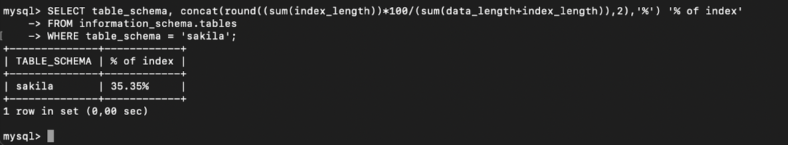

# Задание 1
Напишите запрос к учебной базе данных, который вернёт процентное отношение общего размера всех индексов к общему размеру всех таблиц.

Запрос:

```sql
SELECT table_schema, concat(round((sum(index_length))*100/(sum(data_length+index_length)),2),'%') '% of index'
FROM information_schema.tables
WHERE table_schema = 'sakila';
```
Выполнение запроса:


# Задание 2
Выполните explain analyze следующего запроса:

```sql
select distinct concat(c.last_name, ' ', c.first_name), sum(p.amount) over (partition by c.customer_id, f.title)
from payment p, rental r, customer c, inventory i, film f
where date(p.payment_date) = '2005-07-30' and p.payment_date = r.rental_date and r.customer_id = c.customer_id and i.inventory_id = r.inventory_id
```

* перечислите узкие места;
* оптимизируйте запрос: внесите корректировки по использованию операторов, при необходимости добавьте индексы.

**Запрос:**

```sql
EXPLAIN FORMAT = TREE
SELECT
DISTINCT concat(c.last_name, ' ', c.first_name),
sum(p.amount) over (partition by c.customer_id, f.title)
FROM
payment p,
rental r,
customer c,
inventory i,
film f
WHERE date(p.payment_date) = '2005-07-30' and p.payment_date = r.rental_date
and r.customer_id = c.customer_id and i.inventory_id = r.inventory_id;
```

Выполнение запроса:
```text
-> Limit: 200 row(s)  (cost=0..0 rows=0)
-> Table scan on <temporary>  (cost=2.5..2.5 rows=0)
-> Temporary table with deduplication  (cost=0..0 rows=0)
-> Window aggregate with buffering: sum(payment.amount) OVER (PARTITION BY c.customer_id,f.title )
-> Sort: c.customer_id, f.title
-> Stream results  (cost=10.8e+6 rows=16.7e+6)
-> Nested loop inner join  (cost=10.8e+6 rows=16.7e+6)
-> Nested loop inner join  (cost=9.12e+6 rows=16.7e+6)
-> Nested loop inner join  (cost=7.45e+6 rows=16.7e+6)
-> Inner hash join (no condition)  (cost=1.65e+6 rows=16.5e+6)
-> Filter: (cast(p.payment_date as date) = '2005-07-30')  (cost=1.72 rows=16500)
-> Table scan on p  (cost=1.72 rows=16500)
-> Hash
-> Covering index scan on f using idx_title  (cost=103 rows=1000)
-> Covering index lookup on r using rental_date (rental_date=p.payment_date)  (cost=0.25 rows=1.01)
-> Single-row index lookup on c using PRIMARY (customer_id=r.customer_id)  (cost=250e-6 rows=1)
-> Single-row covering index lookup on i using PRIMARY (inventory_id=r.inventory_id)  (cost=250e-6 rows=1)
```

Ответы на вопросы:

* Узкое место - перебор всех таблиц.
1. Можно добавить индекс по условию where, то есть для поля payment_date:
```sql 
create index pd_idx on payment (payment_date);
```

2. Убрать из запроса лишние таблицы такие как: inventory, rental и film. Почему? Есть вероятность, что данный запрос необходим для того, чтобы посчитать сумму платежей за определенные даты и особого смысла в лишних данных нет, тем более что очевидно они утяжеляют запрос.

3. Переписать в запросе соединение таблиц на inner join

**Измененный запрос:**
```sql 
EXPLAIN FORMAT = TREE
select
distinct concat(c.last_name, ' ', c.first_name),
sum(p.amount) over (partition by c.customer_id)
from
payment p
join customer c on
p.customer_id = c.customer_id
where
date(p.payment_date) = '2005-07-30';
```

**Выполненный запрос:**
```text
-> Limit: 200 row(s)  (cost=0..0 rows=0)
-> Table scan on <temporary>  (cost=2.5..2.5 rows=0)
-> Temporary table with deduplication  (cost=0..0 rows=0)
-> Window aggregate with buffering: sum(payment.amount) OVER (PARTITION BY c.customer_id )
-> Sort: c.customer_id
-> Stream results  (cost=7449 rows=16500)
-> Nested loop inner join  (cost=7449 rows=16500)
-> Filter: (cast(p.payment_date as date) = '2005-07-30')  (cost=1674 rows=16500)
-> Table scan on p  (cost=1674 rows=16500)
-> Single-row index lookup on c using PRIMARY (customer_id=p.customer_id)  (cost=0.25 rows=1)
```