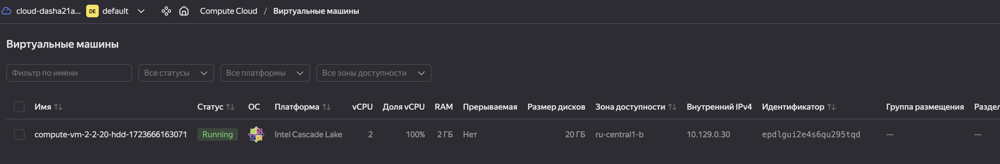

# Домашнее задание к занятию 2 «Работа с Playbook»

## Подготовка к выполнению

1. * Необязательно. Изучите, что такое [ClickHouse](https://www.youtube.com/watch?v=fjTNS2zkeBs) и [Vector](https://www.youtube.com/watch?v=CgEhyffisLY).
2. Создайте свой публичный репозиторий на GitHub с произвольным именем или используйте старый.
3. Скачайте [Playbook](./playbook/) из репозитория с домашним заданием и перенесите его в свой репозиторий.
4. Подготовьте хосты в соответствии с группами из предподготовленного playbook.

## Подготовка
1. Создана виртуальная машина в Yandex Cloud

2. 

## Основная часть


1. Подготовьте свой inventory-файл `prod.yml`.
   2. Файл [здесь](playbook/inventory/prod.yml)
2. Допишите playbook: нужно сделать ещё один play, который устанавливает и настраивает [vector](https://vector.dev). Конфигурация vector должна деплоиться через template файл jinja2. От вас не требуется использовать все возможности шаблонизатора, просто вставьте стандартный конфиг в template файл. Информация по шаблонам по [ссылке](https://www.dmosk.ru/instruktions.php?object=ansible-nginx-install). не забудьте сделать handler на перезапуск vector в случае изменения конфигурации!
```text
daracvetkova@192-168-1-120 playbook % ansible-playbook -i inventory/prod.yml site.yml

PLAY [Install Clickhouse] *******************************************************************************************************************

TASK [Gathering Facts] **********************************************************************************************************************
ok: [clickhouse-01]

TASK [Get clickhouse distrib] ***************************************************************************************************************
ok: [clickhouse-01] => (item=clickhouse-client)
ok: [clickhouse-01] => (item=clickhouse-server)
failed: [clickhouse-01] (item=clickhouse-common-static) => {"ansible_loop_var": "item", "changed": false, "dest": "./clickhouse-common-static-22.3.3.44.rpm", "elapsed": 0, "gid": 1000, "group": "dasha21a", "item": "clickhouse-common-static", "mode": "0664", "msg": "Request failed", "owner": "dasha21a", "response": "HTTP Error 404: Not Found", "secontext": "unconfined_u:object_r:user_home_t:s0", "size": 246310036, "state": "file", "status_code": 404, "uid": 1000, "url": "https://packages.clickhouse.com/rpm/stable/clickhouse-common-static-22.3.3.44.noarch.rpm"}

TASK [Get clickhouse distrib] ***************************************************************************************************************
ok: [clickhouse-01]

TASK [Install clickhouse packages] **********************************************************************************************************
ok: [clickhouse-01]

TASK [Flush handlers] ***********************************************************************************************************************

TASK [Create database] **********************************************************************************************************************
ok: [clickhouse-01]

PLAY [Install Vector] ***********************************************************************************************************************

TASK [Gathering Facts] **********************************************************************************************************************
ok: [clickhouse-01]

TASK [Get Vector distrib] *******************************************************************************************************************
changed: [clickhouse-01]

TASK [Install Vector package] ***************************************************************************************************************
changed: [clickhouse-01]

TASK [Flush handlers] ***********************************************************************************************************************

RUNNING HANDLER [Start Vector service] ******************************************************************************************************
changed: [clickhouse-01]

PLAY RECAP **********************************************************************************************************************************
clickhouse-01              : ok=8    changed=3    unreachable=0    failed=0    skipped=0    rescued=1    ignored=0
```
3. При создании tasks рекомендую использовать модули: `get_url`, `template`, `unarchive`, `file`.
4. Tasks должны: скачать дистрибутив нужной версии, выполнить распаковку в выбранную директорию, установить vector.
5. Запустите `ansible-lint site.yml` и исправьте ошибки, если они есть.
```text
daracvetkova@192-168-1-120 playbook % ansible-lint site.yml --profile min
WARNING: PATH altered to include /opt/homebrew/Cellar/ansible-lint/24.7.0/libexec/bin, /opt/homebrew/Cellar/ansible-lint/24.7.0/libexec/bin :: This is usually a sign of broken local setup, which can cause unexpected behaviors.

Passed: 0 failure(s), 0 warning(s) on 1 files. Profile 'min' was required, but 'production' profile passed.

```

6. Попробуйте запустить playbook на этом окружении с флагом `--check`.
```text
daracvetkova@192-168-1-120 playbook % ansible-playbook -i inventory/prod.yml site.yml --check

PLAY [Install Clickhouse] *******************************************************************************************************************

TASK [Gathering Facts] **********************************************************************************************************************
ok: [clickhouse-01]

TASK [Get clickhouse distrib] ***************************************************************************************************************
ok: [clickhouse-01] => (item=clickhouse-client)
ok: [clickhouse-01] => (item=clickhouse-server)
failed: [clickhouse-01] (item=clickhouse-common-static) => {"ansible_loop_var": "item", "changed": false, "dest": "./clickhouse-common-static-22.3.3.44.rpm", "elapsed": 0, "gid": 1000, "group": "dasha21a", "item": "clickhouse-common-static", "mode": "0664", "msg": "Request failed", "owner": "dasha21a", "response": "HTTP Error 404: Not Found", "secontext": "unconfined_u:object_r:user_home_t:s0", "size": 246310036, "state": "file", "status_code": 404, "uid": 1000, "url": "https://packages.clickhouse.com/rpm/stable/clickhouse-common-static-22.3.3.44.noarch.rpm"}

TASK [Get clickhouse distrib] ***************************************************************************************************************
ok: [clickhouse-01]

TASK [Install clickhouse packages] **********************************************************************************************************
ok: [clickhouse-01]

TASK [Flush handlers] ***********************************************************************************************************************

TASK [Create database] **********************************************************************************************************************
ok: [clickhouse-01]

PLAY [Install Vector] ***********************************************************************************************************************

TASK [Gathering Facts] **********************************************************************************************************************
ok: [clickhouse-01]

TASK [Get Vector distrib] *******************************************************************************************************************
ok: [clickhouse-01]

TASK [Install Vector package] ***************************************************************************************************************
ok: [clickhouse-01]

TASK [Flush handlers] ***********************************************************************************************************************

RUNNING HANDLER [Start Vector service] ******************************************************************************************************
ok: [clickhouse-01]

PLAY RECAP **********************************************************************************************************************************
clickhouse-01              : ok=8    changed=0    unreachable=0    failed=0    skipped=0    rescued=1    ignored=0
```
7. Запустите playbook на `prod.yml` окружении с флагом `--diff`. Убедитесь, что изменения на системе произведены.
```text
daracvetkova@192-168-1-120 playbook % ansible-playbook -i inventory/prod.yml site.yml --diff

PLAY [Install Clickhouse] *******************************************************************************************************************

TASK [Gathering Facts] **********************************************************************************************************************
ok: [clickhouse-01]

TASK [Get clickhouse distrib] ***************************************************************************************************************
ok: [clickhouse-01] => (item=clickhouse-client)
ok: [clickhouse-01] => (item=clickhouse-server)
failed: [clickhouse-01] (item=clickhouse-common-static) => {"ansible_loop_var": "item", "changed": false, "dest": "./clickhouse-common-static-22.3.3.44.rpm", "elapsed": 0, "gid": 1000, "group": "dasha21a", "item": "clickhouse-common-static", "mode": "0664", "msg": "Request failed", "owner": "dasha21a", "response": "HTTP Error 404: Not Found", "secontext": "unconfined_u:object_r:user_home_t:s0", "size": 246310036, "state": "file", "status_code": 404, "uid": 1000, "url": "https://packages.clickhouse.com/rpm/stable/clickhouse-common-static-22.3.3.44.noarch.rpm"}

TASK [Get clickhouse distrib] ***************************************************************************************************************
ok: [clickhouse-01]

TASK [Install clickhouse packages] **********************************************************************************************************
ok: [clickhouse-01]

TASK [Flush handlers] ***********************************************************************************************************************

TASK [Create database] **********************************************************************************************************************
ok: [clickhouse-01]

PLAY [Install Vector] ***********************************************************************************************************************

TASK [Gathering Facts] **********************************************************************************************************************
ok: [clickhouse-01]

TASK [Get Vector distrib] *******************************************************************************************************************
ok: [clickhouse-01]

TASK [Install Vector package] ***************************************************************************************************************
ok: [clickhouse-01]

TASK [Flush handlers] ***********************************************************************************************************************

RUNNING HANDLER [Start Vector service] ******************************************************************************************************
ok: [clickhouse-01]

PLAY RECAP **********************************************************************************************************************************
clickhouse-01              : ok=8    changed=0    unreachable=0    failed=0    skipped=0    rescued=1    ignored=0
```
8. Повторно запустите playbook с флагом `--diff` и убедитесь, что playbook идемпотентен.
```text
daracvetkova@192-168-1-120 playbook % ansible-playbook -i inventory/prod.yml site.yml --diff

PLAY [Install Clickhouse] *******************************************************************************************************************

TASK [Gathering Facts] **********************************************************************************************************************
ok: [clickhouse-01]

TASK [Get clickhouse distrib] ***************************************************************************************************************
ok: [clickhouse-01] => (item=clickhouse-client)
ok: [clickhouse-01] => (item=clickhouse-server)
failed: [clickhouse-01] (item=clickhouse-common-static) => {"ansible_loop_var": "item", "changed": false, "dest": "./clickhouse-common-static-22.3.3.44.rpm", "elapsed": 0, "gid": 1000, "group": "dasha21a", "item": "clickhouse-common-static", "mode": "0664", "msg": "Request failed", "owner": "dasha21a", "response": "HTTP Error 404: Not Found", "secontext": "unconfined_u:object_r:user_home_t:s0", "size": 246310036, "state": "file", "status_code": 404, "uid": 1000, "url": "https://packages.clickhouse.com/rpm/stable/clickhouse-common-static-22.3.3.44.noarch.rpm"}

TASK [Get clickhouse distrib] ***************************************************************************************************************
ok: [clickhouse-01]

TASK [Install clickhouse packages] **********************************************************************************************************
ok: [clickhouse-01]

TASK [Flush handlers] ***********************************************************************************************************************

TASK [Create database] **********************************************************************************************************************
ok: [clickhouse-01]

PLAY [Install Vector] ***********************************************************************************************************************

TASK [Gathering Facts] **********************************************************************************************************************
ok: [clickhouse-01]

TASK [Get Vector distrib] *******************************************************************************************************************
ok: [clickhouse-01]

TASK [Install Vector package] ***************************************************************************************************************
ok: [clickhouse-01]

TASK [Flush handlers] ***********************************************************************************************************************

RUNNING HANDLER [Start Vector service] ******************************************************************************************************
ok: [clickhouse-01]

PLAY RECAP **********************************************************************************************************************************
clickhouse-01              : ok=8    changed=0    unreachable=0    failed=0    skipped=0    rescued=1    ignored=0
```
9. Подготовьте README.md-файл по своему playbook. В нём должно быть описано: что делает playbook, какие у него есть параметры и теги. Пример качественной документации ansible playbook по [ссылке](https://github.com/opensearch-project/ansible-playbook). Так же приложите скриншоты выполнения заданий №5-8
10. Готовый playbook выложите в свой репозиторий, поставьте тег `08-ansible-02-playbook` на фиксирующий коммит, в ответ предоставьте ссылку на него.

---

### Как оформить решение задания

Выполненное домашнее задание пришлите в виде ссылки на .md-файл в вашем репозитории.

---