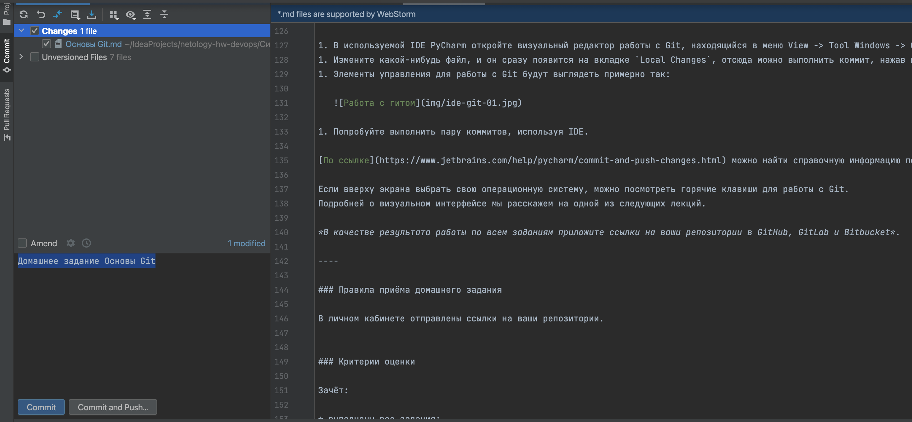

# Домашнее задание к занятию «Основы Git»

## Задание 1. Знакомимся с GitLab и Bitbucket

Из-за сложности доступа к Bitbucket в работе достаточно использовать два репозитория: GitHub и GitLab.

Иногда при работе с Git-репозиториями надо настроить свой локальный репозиторий так, чтобы можно было
отправлять и принимать изменения из нескольких удалённых репозиториев.

Это может понадобиться при работе над проектом с открытым исходным кодом, если автор проекта не даёт права на запись в основной репозиторий.

Также некоторые распределённые команды используют такой принцип работы, когда каждый разработчик имеет свой репозиторий, а в основной репозиторий пушатся только конечные результаты
работы над задачами.

### GitLab

Создадим аккаунт в GitLab, если у вас его ещё нет:

1. GitLab. Для [регистрации](https://gitlab.com/users/sign_up)  можно использовать аккаунт Google, GitHub и другие.
1. После регистрации или авторизации в GitLab создайте новый проект, нажав на ссылку `Create a projet`.
Желательно назвать также, как и в GitHub — `devops-netology` и `visibility level`, выбрать `Public`.
1. Галочку `Initialize repository with a README` лучше не ставить, чтобы не пришлось разрешать конфликты.
1. Если вы зарегистрировались при помощи аккаунта в другой системе и не указали пароль, то увидите сообщение:
`You won't be able to pull or push project code via HTTPS until you set a password on your account`.
Тогда перейдите [по ссылке](https://gitlab.com/profile/password/edit) из этого сообщения и задайте пароль.
Если вы уже умеете пользоваться SSH-ключами, то воспользуйтесь этой возможностью (подробнее про SSH мы поговорим в следующем учебном блоке).
1. Перейдите на страницу созданного вами репозитория, URL будет примерно такой:
https://gitlab.com/YOUR_LOGIN/devops-netology. Изучите предлагаемые варианты для начала работы в репозитории в секции
`Command line instructions`.
1. Запомните вывод команды `git remote -v`.
1. Из-за того, что это будет наш дополнительный репозиторий, ни один вариант из перечисленных в инструкции (на странице
вновь созданного репозитория) нам не подходит. Поэтому добавляем этот репозиторий, как дополнительный `remote`, к созданному
репозиторию в рамках предыдущего домашнего задания:
`git remote add gitlab https://gitlab.com/YOUR_LOGIN/devops-netology.git`.
1. Отправьте изменения в новый удалённый репозиторий `git push -u gitlab main`.
1. Обратите внимание, как изменился результат работы команды `git remote -v`.


Ответ:
```git
daracvetkova@192-168-1-120 netology-hw-devops % git remote add gitlab-ntg https://gitlab.com/Darya21a5a/devops-netology.git
daracvetkova@192-168-1-120 netology-hw-devops % git push -u gitlab-ntg main
Перечисление объектов: 59, готово.
Подсчет объектов: 100% (59/59), готово.
При сжатии изменений используется до 8 потоков
Сжатие объектов: 100% (39/39), готово.
Запись объектов: 100% (59/59), 1.45 МиБ | 211.90 МиБ/с, готово.
Всего 59 (изменений 16), повторно использовано 53 (изменений 14), повторно использовано пакетов 0
To https://gitlab.com/Darya21a5a/devops-netology.git
 * [new branch]      main -> main
branch 'main' set up to track 'gitlab-ntg/main'.
daracvetkova@192-168-1-120 netology-hw-devops % git remote -v
gitlab  https://gitlab.com/Darya21a5a/devops-netology-task.git (fetch)
gitlab  https://gitlab.com/Darya21a5a/devops-netology-task.git (push)
gitlab-ntg      https://gitlab.com/Darya21a5a/devops-netology.git (fetch)
gitlab-ntg      https://gitlab.com/Darya21a5a/devops-netology.git (push)
origin  https://github.com/dariatsv/netology-hw-devops.git (fetch)
origin  https://github.com/dariatsv/netology-hw-devops.git (push)
```

## Задание 2. Теги

Представьте ситуацию, когда в коде была обнаружена ошибка — надо вернуться на предыдущую версию кода,
исправить её и выложить исправленный код в продакшн. Мы никуда не будем выкладывать код, но пометим некоторые коммиты тегами и создадим от них ветки.

1. Создайте легковестный тег `v0.0` на HEAD-коммите и запуште его во все три добавленных на предыдущем этапе `upstream`.
1. Аналогично создайте аннотированный тег `v0.1`.
1. Перейдите на страницу просмотра тегов в GitHab (и в других репозиториях) и посмотрите, чем отличаются созданные теги.
    * в GitHub — https://github.com/YOUR_ACCOUNT/devops-netology/releases;
    * в GitLab — https://gitlab.com/YOUR_ACCOUNT/devops-netology/-/tags;
    * в Bitbucket — список тегов расположен в выпадающем меню веток на отдельной вкладке.

Ответ:
```git

daracvetkova@192-168-1-120 netology-hw-devops % git tag v0.0
daracvetkova@192-168-1-120 netology-hw-devops % git tag
v0.0
daracvetkova@192-168-1-120 netology-hw-devops % git push origin v0.0
Всего 0 (изменений 0), повторно использовано 0 (изменений 0), повторно использовано пакетов 0
To https://github.com/dariatsv/netology-hw-devops.git
 * [new tag]         v0.0 -> v0.0
```
## Задание 3. Ветки

Давайте посмотрим, как будет выглядеть история коммитов при создании веток.

1. Переключитесь обратно на ветку `main`, которая должна быть связана с веткой `main` репозитория на `github`.
1. Посмотрите лог коммитов и найдите хеш коммита с названием `Prepare to delete and move`, который был создан в пределах предыдущего домашнего задания.
1. Выполните `git checkout` по хешу найденного коммита.
1. Создайте новую ветку `fix`, базируясь на этом коммите `git switch -c fix`.
1. Отправьте новую ветку в репозиторий на GitHub `git push -u origin fix`.
1. Посмотрите, как визуально выглядит ваша схема коммитов: https://github.com/YOUR_ACCOUNT/devops-netology/network.
1. Теперь измените содержание файла `README.md`, добавив новую строчку.
1. Отправьте изменения в репозиторий и посмотрите, как изменится схема на странице https://github.com/YOUR_ACCOUNT/devops-netology/network
и как изменится вывод команды `git log`.

 Ответ:
```git

daracvetkova@192-168-1-120 netology-hw-devops % git -c checkout c4cb05c40a78698da476a35b307e46e7603ee34
daracvetkova@192-168-1-120 netology-hw-devops % git switch -c fix
Переключились на новую ветку «fix»
daracvetkova@192-168-1-120 netology-hw-devops % git push -u origin fix
Всего 0 (изменений 0), повторно использовано 0 (изменений 0), повторно использовано пакетов 0
remote:
remote: Create a pull request for 'fix' on GitHub by visiting:
remote:      https://github.com/dariatsv/netology-hw-devops/pull/new/fix
remote:
To https://github.com/dariatsv/netology-hw-devops.git
 * [new branch]      fix -> fix
branch 'fix' set up to track 'origin/fix'.

daracvetkova@192-168-1-120 netology-hw-devops % git log
commit 25145f9e2e9b9274fa233f073541bf28ec5733ba (HEAD -> fix, origin/fix)
Author: Daria <dasha21a@icloud.com>
Date:   Sun Mar 3 18:47:55 2024 +0300

    new line

```

## Задание 4. Упрощаем себе жизнь

Попробуем поработь с Git при помощи визуального редактора.

1. В используемой IDE PyCharm откройте визуальный редактор работы с Git, находящийся в меню View -> Tool Windows -> Git.
1. Измените какой-нибудь файл, и он сразу появится на вкладке `Local Changes`, отсюда можно выполнить коммит, нажав на кнопку внизу этого диалога.
1. Элементы управления для работы с Git будут выглядеть примерно так:

   

1. Попробуйте выполнить пару коммитов, используя IDE.

[По ссылке](https://www.jetbrains.com/help/pycharm/commit-and-push-changes.html) можно найти справочную информацию по визуальному интерфейсу.

Если вверху экрана выбрать свою операционную систему, можно посмотреть горячие клавиши для работы с Git.
Подробней о визуальном интерфейсе мы расскажем на одной из следующих лекций.

*В качестве результата работы по всем заданиям приложите ссылки на ваши репозитории в GitHub, GitLab и Bitbucket*.

Ответ:
Коммит с IDEA:

----

### Правила приёма домашнего задания

Ссылки на репозитории:
Github: https://github.com/dariatsv/netology-hw-devops

Gitlab:
https://gitlab.com/Darya21a5a/devops-netology